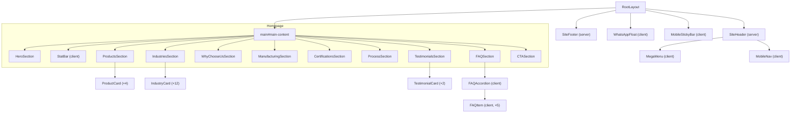
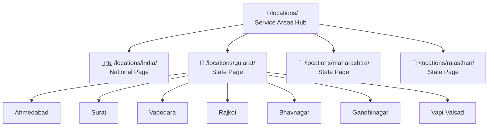

# 🏛️ Honeywell Hydraulics — Technical Architecture
### Principal Next.js Architect Specification

**Framework:** Next.js 15 (App Router)
**Rendering:** Static Site Generation (SSG) + Incremental Static Regeneration (ISR)
**Hosting:** Vercel (recommended) or Cloudflare Pages
**CMS:** MDX files in repository (no external CMS)
**Source Documents:** All 8 project documents + 4 design skills

---

## Architecture Principles

```
1. SEO-FIRST       → Every architectural decision optimizes for crawlability,
                       indexability, and Core Web Vitals
2. STATIC-FIRST    → SSG by default. Server components for everything.
                       Client components only when interactivity is required.
3. CONTENT-DRIVEN  → Content lives in MDX/JSON files, not a database.
                       Developers and content writers use the same workflow.
4. SCALABLE        → Architecture supports 100+ pages today, 500+ tomorrow.
                       Adding a new product/industry/location = adding 1 MDX file.
5. ZERO BLOAT      → No WordPress. No Elementor. No WooCommerce.
                       Sub-2s LCP on every page.
```

---

# 1. FOLDER STRUCTURE

```
honeywell-hydraulics/
│
├── app/                              # Next.js App Router
│   ├── layout.tsx                    # Root layout (HTML shell, fonts, analytics)
│   ├── page.tsx                      # Homepage (/)
│   ├── not-found.tsx                 # Custom 404
│   ├── sitemap.ts                    # Dynamic XML sitemap generator
│   ├── robots.ts                     # Dynamic robots.txt generator
│   ├── manifest.ts                   # Web manifest generator
│   │
│   ├── (marketing)/                  # Route group: marketing pages (shared layout)
│   │   ├── layout.tsx                # Marketing layout (header + footer)
│   │   │
│   │   ├── about/
│   │   │   └── page.tsx              # /about/
│   │   ├── contact/
│   │   │   └── page.tsx              # /contact/
│   │   ├── request-quote/
│   │   │   └── page.tsx              # /request-quote/
│   │   ├── clients/
│   │   │   └── page.tsx              # /clients/
│   │   ├── certifications/
│   │   │   └── page.tsx              # /certifications/
│   │   ├── privacy-policy/
│   │   │   └── page.tsx              # /privacy-policy/
│   │   ├── terms-conditions/
│   │   │   └── page.tsx              # /terms-conditions/
│   │   └── sitemap/
│   │       └── page.tsx              # /sitemap/ (HTML sitemap)
│   │
│   ├── hydraulic-cylinders/          # Product Silo 1
│   │   ├── page.tsx                  # /hydraulic-cylinders/ (pillar)
│   │   └── [slug]/
│   │       └── page.tsx              # /hydraulic-cylinders/[slug]/ (product)
│   │
│   ├── hydraulic-power-packs/        # Product Silo 2
│   │   ├── page.tsx                  # /hydraulic-power-packs/ (pillar)
│   │   └── [slug]/
│   │       └── page.tsx              # /hydraulic-power-packs/[slug]/ (product)
│   │
│   ├── manifold-blocks/              # Product Silo 3
│   │   ├── page.tsx                  # /manifold-blocks/ (pillar)
│   │   └── [slug]/
│   │       └── page.tsx              # /manifold-blocks/[slug]/ (product)
│   │
│   ├── hydraulic-systems/            # Product Silo 4
│   │   └── page.tsx                  # /hydraulic-systems/ (single page)
│   │
│   ├── industries/                   # Industry pages
│   │   ├── page.tsx                  # /industries/ (hub)
│   │   └── [slug]/
│   │       └── page.tsx              # /industries/[slug]/ (industry)
│   │
│   ├── locations/                    # Location pages
│   │   ├── page.tsx                  # /locations/ (hub with map)
│   │   └── [slug]/
│   │       └── page.tsx              # /locations/[slug]/ (city/state/country)
│   │
│   ├── blog/                         # Blog
│   │   ├── page.tsx                  # /blog/ (index with pagination)
│   │   └── [slug]/
│   │       └── page.tsx              # /blog/[slug]/ (article)
│   │
│   ├── case-studies/                 # Case studies
│   │   ├── page.tsx                  # /case-studies/ (index)
│   │   └── [slug]/
│   │       └── page.tsx              # /case-studies/[slug]/ (case study)
│   │
│   ├── resources/                    # Resource pages
│   │   ├── downloads/
│   │   │   └── page.tsx              # /resources/downloads/
│   │   ├── gallery/
│   │   │   ├── page.tsx              # /resources/gallery/
│   │   │   ├── factory/
│   │   │   │   └── page.tsx          # /resources/gallery/factory/
│   │   │   └── products/
│   │   │       └── page.tsx          # /resources/gallery/products/
│   │   ├── faq/
│   │   │   └── page.tsx              # /resources/faq/
│   │   ├── tools/
│   │   │   ├── bore-size-calculator/
│   │   │   │   └── page.tsx          # /resources/tools/bore-size-calculator/
│   │   │   └── pressure-calculator/
│   │   │       └── page.tsx          # /resources/tools/pressure-calculator/
│   │   └── videos/
│   │       └── page.tsx              # /resources/videos/
│   │
│   └── api/                          # API routes
│       ├── quote/
│       │   └── route.ts              # POST /api/quote (form submission)
│       └── contact/
│           └── route.ts              # POST /api/contact (form submission)
│
├── components/                        # React components
│   ├── layout/                        # Layout components
│   │   ├── SiteHeader.tsx
│   │   ├── SiteFooter.tsx
│   │   ├── MegaMenu.tsx
│   │   ├── MobileNav.tsx
│   │   ├── Breadcrumb.tsx
│   │   └── MobileStickyBar.tsx
│   │
│   ├── sections/                      # Page section components
│   │   ├── HeroSection.tsx
│   │   ├── StatBar.tsx
│   │   ├── ProductsSection.tsx
│   │   ├── IndustriesSection.tsx
│   │   ├── WhyChooseUsSection.tsx
│   │   ├── ManufacturingSection.tsx
│   │   ├── CertificationsSection.tsx
│   │   ├── ProcessSection.tsx
│   │   ├── TestimonialsSection.tsx
│   │   ├── FAQSection.tsx
│   │   └── CTASection.tsx
│   │
│   ├── cards/                         # Card components
│   │   ├── ProductCard.tsx
│   │   ├── IndustryCard.tsx
│   │   ├── TestimonialCard.tsx
│   │   ├── BlogCard.tsx
│   │   ├── CaseStudyCard.tsx
│   │   └── StatCard.tsx
│   │
│   ├── forms/                         # Form components
│   │   ├── QuoteForm.tsx              # Client component ('use client')
│   │   ├── ContactForm.tsx            # Client component
│   │   ├── InlineQuoteForm.tsx        # Client component
│   │   ├── FormInput.tsx
│   │   ├── FormSelect.tsx
│   │   ├── FormTextarea.tsx
│   │   └── FormError.tsx
│   │
│   ├── ui/                            # Shared primitives
│   │   ├── Button.tsx
│   │   ├── SectionHeader.tsx
│   │   ├── Container.tsx
│   │   ├── Grid.tsx
│   │   ├── FAQAccordion.tsx           # Client component (toggle state)
│   │   ├── FAQItem.tsx                # Client component
│   │   ├── WhatsAppFloat.tsx
│   │   ├── Toast.tsx                  # Client component
│   │   ├── Skeleton.tsx
│   │   ├── Icon.tsx
│   │   └── OptimizedImage.tsx         # Wrapper around next/image
│   │
│   └── seo/                           # SEO components
│       ├── SchemaOrganization.tsx      # Organization JSON-LD
│       ├── SchemaLocalBusiness.tsx     # LocalBusiness JSON-LD
│       ├── SchemaProduct.tsx          # Product JSON-LD
│       ├── SchemaArticle.tsx          # Article JSON-LD
│       ├── SchemaFAQ.tsx              # FAQPage JSON-LD
│       ├── SchemaBreadcrumb.tsx       # BreadcrumbList JSON-LD
│       └── SchemaWebSite.tsx          # WebSite + SearchAction JSON-LD
│
├── content/                           # Content files (MDX + JSON)
│   ├── products/
│   │   ├── cylinders/
│   │   │   ├── _category.json         # Pillar page metadata
│   │   │   ├── double-acting.mdx
│   │   │   ├── single-acting.mdx
│   │   │   ├── flange-mounting.mdx
│   │   │   ├── clevis-mounting.mdx
│   │   │   ├── trunnion-mounting.mdx
│   │   │   ├── tie-rod.mdx
│   │   │   ├── telescopic.mdx
│   │   │   └── square-body-jack.mdx
│   │   ├── power-packs/
│   │   │   ├── _category.json
│   │   │   ├── 3-phase.mdx
│   │   │   ├── single-phase.mdx
│   │   │   ├── for-press.mdx
│   │   │   ├── for-lift.mdx
│   │   │   ├── with-accumulator.mdx
│   │   │   ├── solenoid-valve.mdx
│   │   │   └── hand-lever-operated.mdx
│   │   ├── manifold-blocks/
│   │   │   ├── _category.json
│   │   │   ├── 06-size-multi-station.mdx
│   │   │   ├── 06-size-single-station.mdx
│   │   │   ├── 10-size-single-station.mdx
│   │   │   └── high-low-system.mdx
│   │   └── systems/
│   │       └── _category.json
│   │
│   │   ├── press-machines.mdx
│   │   ├── goods-lifts.mdx
│   │   ├── passenger-lifts.mdx
│   │   ├── car-parking-systems.mdx
│   │   ├── scissor-tables.mdx
│   │   └── construction-equipment.mdx
│   │
│   ├── industries/
│   │   ├── injection-moulding.mdx
│   │   ├── roto-moulding.mdx
│   │   ├── press-metal-forming.mdx
│   │   ├── rolling-mills.mdx
│   │   ├── printing.mdx
│   │   ├── fly-ash-brick.mdx
│   │   ├── automotive.mdx
│   │   ├── steel-metallurgy.mdx
│   │   ├── wooden-machinery.mdx
│   │   └── agricultural-equipment.mdx
│   │
│   ├── locations/
│   │   ├── ahmedabad.mdx
│   │   ├── surat.mdx
│   │   ├── vadodara.mdx
│   │   ├── rajkot.mdx
│   │   ├── bhavnagar.mdx
│   │   ├── gandhinagar.mdx
│   │   ├── vapi-valsad.mdx
│   │   ├── gujarat.mdx
│   │   ├── maharashtra.mdx
│   │   ├── rajasthan.mdx
│   │   └── india.mdx
│   │
│   ├── blog/
│   │   ├── types-of-hydraulic-cylinders.mdx
│   │   ├── how-hydraulic-cylinder-works.mdx
│   │   ├── double-acting-vs-single-acting.mdx
│   │   └── ... (25 articles)
│   │
│   ├── case-studies/
│   │   ├── injection-moulding-press-ahmedabad.mdx
│   │   ├── car-parking-system-surat.mdx
│   │   ├── goods-lift-system-vadodara.mdx
│   │   ├── press-machine-rajkot.mdx
│   │   └── rolling-mill-system.mdx
│   │
│   └── testimonials.json              # All testimonials in one file
│
├── lib/                               # Utilities and helpers
│   ├── content.ts                     # Content loading utilities
│   ├── mdx.ts                         # MDX parsing configuration
│   ├── metadata.ts                    # Metadata generation helpers
│   ├── schema.ts                      # Schema.org generation helpers
│   ├── navigation.ts                  # Navigation data and helpers
│   ├── constants.ts                   # Site-wide constants (NAP, URLs, etc.)
│   ├── redirects.ts                   # Old-to-new URL redirect map
│   └── utils.ts                       # Generic utilities
│
├── styles/                            # Global styles
│   ├── globals.css                    # Reset + base + tokens
│   ├── tokens.css                     # CSS custom properties (from design system)
│   ├── typography.css                 # Type scale + font loading
│   ├── components.css                 # Shared component styles
│   └── animations.css                 # Keyframes + scroll animations
│
├── public/                            # Static assets
│   ├── images/
│   │   ├── products/                  # Product photography
│   │   │   ├── double-acting-cylinder.webp
│   │   │   ├── double-acting-cylinder-400w.webp
│   │   │   ├── double-acting-cylinder-800w.webp
│   │   │   └── ...
│   │   ├── factory/                   # Factory photography
│   │   ├── team/                      # Team photography
│   │   ├── industries/                # Industry-specific images
│   │   ├── og/                        # Open Graph images (1200×630)
│   │   │   ├── homepage-og.jpg
│   │   │   ├── hydraulic-cylinders-og.jpg
│   │   │   └── ...
│   │   └── logo/
│   │       ├── honeywell-hydraulics-logo.svg
│   │       ├── honeywell-hydraulics-logo-white.svg
│   │       └── honeywell-hydraulics-logo.png
│   ├── favicon.svg
│   ├── favicon-32x32.png
│   ├── favicon-16x16.png
│   ├── apple-touch-icon.png
│   └── downloads/                     # Downloadable PDFs
│       ├── honeywell-hydraulics-catalog.pdf
│       └── ...
│
├── next.config.ts                     # Next.js configuration
├── tailwind.config.ts                 # NOT USED — vanilla CSS
├── tsconfig.json                      # TypeScript configuration
├── package.json
└── .env.local                         # Environment variables
```

---

# 2. APP ROUTER STRUCTURE

## 2.1 Route Map

| Route Pattern | File | Rendering | Cache |
|---|---|---|---|
| `/` | `app/page.tsx` | SSG | `revalidate: 3600` (1hr) |
| `/about/` | `app/(marketing)/about/page.tsx` | SSG | Static |
| `/contact/` | `app/(marketing)/contact/page.tsx` | SSG | Static |
| `/request-quote/` | `app/(marketing)/request-quote/page.tsx` | SSG | Static |
| `/hydraulic-cylinders/` | `app/hydraulic-cylinders/page.tsx` | SSG | `revalidate: 3600` |
| `/hydraulic-cylinders/[slug]/` | `app/hydraulic-cylinders/[slug]/page.tsx` | SSG | Static |
| `/hydraulic-power-packs/` | `app/hydraulic-power-packs/page.tsx` | SSG | `revalidate: 3600` |
| `/hydraulic-power-packs/[slug]/` | `app/hydraulic-power-packs/[slug]/page.tsx` | SSG | Static |
| `/manifold-blocks/` | `app/manifold-blocks/page.tsx` | SSG | `revalidate: 3600` |
| `/manifold-blocks/[slug]/` | `app/manifold-blocks/[slug]/page.tsx` | SSG | Static |
| `/hydraulic-systems/` | `app/hydraulic-systems/page.tsx` | SSG | Static |
| `/industries/` | `app/industries/page.tsx` | SSG | Static |
| `/industries/[slug]/` | `app/industries/[slug]/page.tsx` | SSG | Static |
| `/locations/` | `app/locations/page.tsx` | SSG | Static |
| `/locations/[slug]/` | `app/locations/[slug]/page.tsx` | SSG | Static |
| `/blog/` | `app/blog/page.tsx` | SSG | `revalidate: 3600` |
| `/blog/[slug]/` | `app/blog/[slug]/page.tsx` | SSG | Static |
| `/case-studies/` | `app/case-studies/page.tsx` | SSG | Static |
| `/case-studies/[slug]/` | `app/case-studies/[slug]/page.tsx` | SSG | Static |
| `/resources/*` | `app/resources/*/page.tsx` | SSG | Static |
| `/api/quote` | `app/api/quote/route.ts` | Server | No cache |
| `/api/contact` | `app/api/contact/route.ts` | Server | No cache |

## 2.2 Dynamic Route Generation

All `[slug]` routes use `generateStaticParams()` to pre-build at build time:

```
// Example: app/hydraulic-cylinders/[slug]/page.tsx

export async function generateStaticParams() {
  const products = await getProductsByCategory('cylinders')
  return products.map((product) => ({
    slug: product.slug,
  }))
}
```

This ensures:
- All 102+ pages are pre-rendered as static HTML at build time
- Zero server-side computation at request time
- Sub-100ms TTFB from CDN edge

## 2.3 Route Groups

| Group | Purpose | Shared Layout |
|---|---|---|
| `(marketing)` | Core/utility pages (about, contact, etc.) | Marketing layout with header + footer |
| Root-level product routes | Product pages need different breadcrumb context | Product layout with pillar nav |

> **Why no `(products)` route group?** Product URLs must be `/hydraulic-cylinders/` not `/(products)/hydraulic-cylinders/`. Route groups with `()` don't affect URL, but keeping products at root level simplifies the folder structure and matches the URL hierarchy exactly.

## 2.4 Trailing Slash Enforcement

```typescript
// next.config.ts
const nextConfig = {
  trailingSlash: true,  // Enforces trailing slash on all routes
  // ...
}
```

This matches the URL convention defined in the Website Architecture document. All URLs end with `/`.

---

# 3. COMPONENT ARCHITECTURE

## 3.1 Server vs Client Components

```
SERVER COMPONENTS (Default — no 'use client' directive)
├── All layout components (SiteHeader, SiteFooter)
├── All section components (HeroSection, ProductsSection, etc.)
├── All card components (ProductCard, IndustryCard, etc.)
├── All SEO/schema components
├── Breadcrumb
├── SectionHeader
├── Container, Grid
├── OptimizedImage
└── Icon

CLIENT COMPONENTS ('use client' directive required)
├── MegaMenu (hover/click state)
├── MobileNav (open/close state)
├── MobileStickyBar (scroll detection)
├── FAQAccordion (expand/collapse state)
├── FAQItem (individual toggle)
├── QuoteForm (form state, validation, submission)
├── ContactForm (form state, validation, submission)
├── InlineQuoteForm (form state)
├── Toast (show/hide state)
├── WhatsAppFloat (pulse animation)
├── StatBar (counter animation, intersection observer)
└── ScrollObserver (animate-on-scroll utility)
```

**Rule:** Client components are leaf nodes. They never wrap server components. Server components can render client components as children.

## 3.2 Component Hierarchy



## 3.3 Component Props Pattern

Each component follows a consistent props interface:

```
// Pattern: Data in, JSX out. No fetching inside components.

interface ProductCardProps {
  title: string
  description: string
  image: {
    src: string
    alt: string
    width: number
    height: number
  }
  href: string
  category?: string
  variant?: 'vertical' | 'horizontal' | 'featured' | 'mini'
}
```

**Data fetching happens in page.tsx (server component), NOT in individual components.**

---

# 4. CONTENT ARCHITECTURE

## 4.1 Content File Format

All content uses MDX with frontmatter metadata:

```
---
title: "Double Acting Hydraulic Cylinder Manufacturer"
slug: "double-acting"
category: "cylinders"
seo:
  title: "Double Acting Hydraulic Cylinder Manufacturer | Ahmedabad India"
  description: "Double acting hydraulic cylinder manufacturer in Ahmedabad..."
  keyword: "double acting hydraulic cylinder manufacturer"
  intent: "transactional"
  priority: "critical"
  canonical: "https://www.honeywellhydraulics.com/hydraulic-cylinders/double-acting/"
  ogImage: "/images/og/double-acting-cylinder-og.jpg"
specs:
  boreRange: "40mm – 300mm"
  strokeRange: "Up to 3000mm"
  pressure: "Up to 250 bar"
  rodMaterial: "Hard Chrome Plated EN8/EN19"
  sealType: "Hallite / Parker"
  mountingTypes: ["Flange", "Clevis", "Trunnion", "Foot"]
relatedProducts:
  - "single-acting"
  - "flange-mounting"
  - "tie-rod"
  - "press-machines"
  - "goods-lifts"
relatedIndustries:
  - "injection-moulding"
  - "automotive"
faq:
  - question: "What bore sizes are available for double acting cylinders?"
    answer: "We manufacture double acting cylinders with bore sizes from 40mm to 300mm..."
  - question: "What is the delivery time for a custom double acting cylinder?"
    answer: "Standard double acting cylinders ship in 7 days..."
---

## Product content in MDX below...
```

## 4.2 Content Loading Architecture

```
lib/content.ts
├── getProductsByCategory(category: string)     → Product[]
├── getProductBySlug(category, slug)            → Product
├── getAllProducts()                             → Product[]
├── getApplicationBySlug(slug)                  → Application
├── getIndustryBySlug(slug)                     → Industry
├── getAllIndustries()                           → Industry[]
├── getLocationBySlug(slug)                     → Location
├── getAllLocations()                            → Location[]
├── getBlogPostBySlug(slug)                     → BlogPost
├── getAllBlogPosts()                            → BlogPost[]
├── getCaseStudyBySlug(slug)                    → CaseStudy
├── getAllCaseStudies()                          → CaseStudy[]
├── getTestimonials()                           → Testimonial[]
└── getNavigationData()                         → NavigationData
```

All content functions read from the `content/` directory at build time. No database. No API calls. Pure file-system reads.

## 4.3 Content Types

```
Product {
  title, slug, category, seo, specs, image, description,
  relatedProducts[], relatedIndustries[],
  faq[], content (MDX)
}

Application {
  title, slug, seo, image, description,
  relatedProducts[], relatedIndustries[],
Industry {
  title, slug, seo, icon, image, description,
  relatedProducts[], content (MDX)
}

Location {
  title, slug, seo, type (city|state|country),
  parentLocation?, coordinates {lat, lng},
  gidcZones[], localIndustries[], content (MDX)
}

BlogPost {
  title, slug, seo, category, author, publishedAt, updatedAt,
  image, readingTime, tags[], content (MDX)
}

CaseStudy {
  title, slug, seo, industry, location, products[],
  challenge, solution, results, images[], content (MDX)
}

Testimonial {
  quote, authorName, authorRole, company, city,
  rating, avatar?
}
```

---

# 5. METADATA ARCHITECTURE

## 5.1 Metadata Generation Pattern

Every `page.tsx` exports a `generateMetadata()` function:

```
// Pattern for all dynamic routes:

export async function generateMetadata({ params }): Promise<Metadata> {
  const product = await getProductBySlug(params.category, params.slug)

  return {
    title: product.seo.title,
    description: product.seo.description,
    alternates: {
      canonical: product.seo.canonical,
    },
    openGraph: {
      title: product.seo.title,
      description: product.seo.description,
      url: product.seo.canonical,
      type: 'product',
      images: [{
        url: product.seo.ogImage,
        width: 1200,
        height: 630,
        alt: product.seo.ogImageAlt,
      }],
      locale: 'en_IN',
      siteName: 'Honeywell Hydraulics',
    },
    twitter: {
      card: 'summary_large_image',
      title: product.seo.title,
      description: product.seo.description,
      images: [product.seo.ogImage],
    },
    robots: {
      index: true,
      follow: true,
      'max-snippet': -1,
      'max-image-preview': 'large',
      'max-video-preview': -1,
    },
    other: {
      'geo.region': 'IN-GJ',
      'geo.placename': 'Ahmedabad',
      'geo.position': '23.0225;72.5714',
      'ICBM': '23.0225, 72.5714',
    },
  }
}
```

## 5.2 Metadata Rules

| Rule | Implementation |
|---|---|
| **Title format** | `{Primary Keyword} {Modifier} \| Honeywell Hydraulics` |
| **Title length** | 50-60 characters. Never truncated. |
| **Description** | 150-160 characters. Unique per page. Ends with CTA. |
| **Canonical** | Self-referencing. `https://www.` + trailing slash. |
| **OG image** | Unique per page. 1200×630 JPEG. `<300KB`. |
| **Robots** | `index, follow` on all content pages. `noindex` on utility pages (privacy, terms). |
| **Language** | `lang="en-IN"` on `<html>`. `og:locale: "en_IN"`. |

## 5.3 Root Layout Metadata

```
// app/layout.tsx — Applied to ALL pages

export const metadata: Metadata = {
  metadataBase: new URL('https://www.honeywellhydraulics.com'),
  title: {
    template: '%s | Honeywell Hydraulics',
    default: 'Hydraulic Cylinder & Power Pack Manufacturer in Ahmedabad | Honeywell Hydraulics',
  },
  icons: {
    icon: [
      { url: '/favicon.svg', type: 'image/svg+xml' },
      { url: '/favicon-32x32.png', sizes: '32x32', type: 'image/png' },
      { url: '/favicon-16x16.png', sizes: '16x16', type: 'image/png' },
    ],
    apple: '/apple-touch-icon.png',
  },
  manifest: '/site.webmanifest',
}
```

---

# 6. SCHEMA ARCHITECTURE

## 6.1 Schema Components

Each schema type is a dedicated server component that renders `<script type="application/ld+json">`:

| Component | Schema Type | Used On |
|---|---|---|
| `SchemaOrganization` | Organization | Homepage (in root layout) |
| `SchemaLocalBusiness` | LocalBusiness | Homepage, Contact, Location pages |
| `SchemaWebSite` | WebSite + SearchAction | Homepage (in root layout) |
| `SchemaProduct` | Product + Offer | Individual product pages |
| `SchemaArticle` | Article + Person | Blog posts, case studies |
| `SchemaFAQ` | FAQPage | Pages with FAQ sections |
| `SchemaBreadcrumb` | BreadcrumbList | All pages except homepage |

## 6.2 Schema Placement Strategy

```
Root Layout (app/layout.tsx):
  └── SchemaOrganization (sitewide, rendered once)

Homepage (app/page.tsx):
  ├── SchemaLocalBusiness
  ├── SchemaWebSite (with SearchAction)
  └── SchemaFAQ (homepage FAQ section)

Product Pages:
  ├── SchemaProduct (with Offer)
  ├── SchemaBreadcrumb
  └── SchemaFAQ (product-specific FAQs)

Blog Posts:
  ├── SchemaArticle (with Person author)
  └── SchemaBreadcrumb

Industry Pages:
  ├── SchemaBreadcrumb
  └── SchemaFAQ (if FAQ section exists)

Location Pages:
  ├── SchemaLocalBusiness (location-specific)
  └── SchemaBreadcrumb

All pages (except homepage):
  └── SchemaBreadcrumb
```

## 6.3 Schema Data Sources

Schema components receive data as props from the page component. Data originates from MDX frontmatter:

```
// Product page schema data flow:
content/products/cylinders/double-acting.mdx (frontmatter)
  → getProductBySlug() (lib/content.ts)
    → page.tsx (server component, passes data as props)
      → SchemaProduct (renders JSON-LD)
```

---

# 7. INTERNAL LINKING ARCHITECTURE

## 7.1 Automatic Link Generation

```
lib/navigation.ts

// Navigation data is generated from content files at build time:

getProductNavigation()    → Mega menu structure
getIndustryNavigation()    → Industry dropdown items
getResourceNavigation()    → Resource dropdown items
getLocationNavigation()    → Footer service area links
getBreadcrumbPath(slug)    → Breadcrumb trail for any page
getRelatedProducts(slug)   → Related products for sidebar/bottom
getRelatedContent(slug)    → Cross-silo links (product ↔ industry)
```

## 7.2 Link Types

| Link Type | Source | Destination | Implementation |
|---|---|---|---|
| **Navigation** | Header mega menu | All pillar + product pages | `MegaMenu` component |
| **Breadcrumb** | Every page | Parent pages | `Breadcrumb` component |
| **Product → Pillar** | Product page | Category pillar | "Back to all cylinders" link |
| **Pillar → Products** | Pillar page | All products in category | Product card grid |
| **Industry → Products** | Industry page | Relevant products | "Products for this industry" section |
| **Blog → Products** | Blog article body | Related products | Contextual inline links in MDX |
| **Case Study → Products** | Case study | Products used | "Products used" section |
| **Case Study → Location** | Case study | Client location | "Location" tag |
| **Case Study → Industry** | Case study | Client industry | "Industry" tag |
| **Footer** | All pages | Pillar, industry, resource, location pages | `SiteFooter` component |
| **CTA** | All pages | `/request-quote/`, `/contact/` | `CTASection`, `Button` components |

## 7.3 Cross-Silo Linking Rules

```
RULE 1: Every industry page links to ≥4 product pages
RULE 2: Every blog post links to ≥2 product pages
RULE 3: Every page links to /request-quote/ (via CTA)
RULE 4: Pillar pages link to ALL child pages (not selective)
RULE 5: Child pages link back to their pillar page
RULE 6: Location pages link to ≥3 product pages + ≥2 industry pages
```

---

# 8. SITEMAP ARCHITECTURE

## 8.1 Dynamic XML Sitemap

```
// app/sitemap.ts

export default async function sitemap(): Promise<MetadataRoute.Sitemap> {
  const products = await getAllProducts()
  const industries = await getAllIndustries()
  const locations = await getAllLocations()
  const blogPosts = await getAllBlogPosts()
  const caseStudies = await getAllCaseStudies()

  const baseUrl = 'https://www.honeywellhydraulics.com'

  return [
    // Core pages
    { url: `${baseUrl}/`, lastModified: new Date(), changeFrequency: 'weekly', priority: 1.0 },
    { url: `${baseUrl}/about/`, priority: 0.7 },
    { url: `${baseUrl}/contact/`, priority: 0.8 },
    { url: `${baseUrl}/request-quote/`, priority: 0.9 },
    // ... all core pages

    // Product pillar pages (priority 0.9)
    { url: `${baseUrl}/hydraulic-cylinders/`, priority: 0.9, changeFrequency: 'weekly' },
    { url: `${baseUrl}/hydraulic-power-packs/`, priority: 0.9, changeFrequency: 'weekly' },
    { url: `${baseUrl}/manifold-blocks/`, priority: 0.8, changeFrequency: 'weekly' },
    { url: `${baseUrl}/hydraulic-systems/`, priority: 0.9, changeFrequency: 'weekly' },

    // Individual product pages (priority 0.8)
    ...products.map((p) => ({
      url: `${baseUrl}/${p.categorySlug}/${p.slug}/`,
      priority: 0.8,
      changeFrequency: 'monthly' as const,
    })),

    // Industry pages (priority 0.8)
    ...industries.map((i) => ({
      url: `${baseUrl}/industries/${i.slug}/`,
      priority: 0.8,
    })),

    // Location pages (priority 0.9 for key, 0.7 for others)
    ...locations.map((l) => ({
      url: `${baseUrl}/${l.slug}/`,
      priority: l.type === 'primary' ? 0.9 : 0.7,
    })),

    // Blog posts (priority 0.7)
    ...blogPosts.map((b) => ({
      url: `${baseUrl}/blog/${b.slug}/`,
      priority: 0.7,
      lastModified: new Date(b.updatedAt),
    })),

    // Case studies (priority 0.6)
    ...caseStudies.map((c) => ({
      url: `${baseUrl}/case-studies/${c.slug}/`,
      priority: 0.6,
    })),

    // Resource pages
    // ... etc.
  ]
}
```

## 8.2 Robots.txt

```
// app/robots.ts

export default function robots(): MetadataRoute.Robots {
  return {
    rules: [
      {
        userAgent: '*',
        allow: '/',
        disallow: ['/api/', '/_next/', '/admin/'],
      },
    ],
    sitemap: 'https://www.honeywellhydraulics.com/sitemap.xml',
  }
}
```

---

# 9. IMAGE ARCHITECTURE

## 9.1 Image Pipeline

```
Source images (high-res)
  → Sharp processing at build time
    → WebP output (primary)
    → AVIF output (progressive enhancement)
    → 3 sizes per image: 400w, 800w, 1200w
    → OG images: 1200×630 JPEG (social sharing)
```

## 9.2 Next.js Image Configuration

```typescript
// next.config.ts
const nextConfig = {
  images: {
    formats: ['image/avif', 'image/webp'],
    deviceSizes: [400, 800, 1200],
    imageSizes: [16, 32, 48, 64, 96, 128, 256],
    minimumCacheTTL: 60 * 60 * 24 * 365, // 1 year
  },
}
```

## 9.3 Image Component Usage

```
// OptimizedImage wrapper component:

<OptimizedImage
  src="/images/products/double-acting-cylinder.webp"
  alt="Double acting hydraulic cylinder with chrome rod — Honeywell Hydraulics Ahmedabad"
  width={800}
  height={600}
  sizes="(max-width: 768px) 100vw, (max-width: 1024px) 50vw, 400px"
  priority={false}         // true only for hero/above-fold images
  loading="lazy"           // "eager" for hero images
  quality={85}
/>
```

## 9.4 Image Naming Convention

```
/images/products/{product-slug}.webp              → Primary product image
/images/products/{product-slug}-{view}.webp       → Additional views (side, top, detail)
/images/products/{product-slug}-{size}w.webp      → Responsive variants
/images/factory/{description}.webp                → Factory photos
/images/industries/{industry-slug}.webp           → Industry-specific images
/images/og/{page-slug}-og.jpg                     → Open Graph images
/images/logo/honeywell-hydraulics-logo.svg        → Logo (SVG for crisp scaling)
/images/team/{name}.webp                          → Team headshots
```

## 9.5 Alt Text Strategy

| Image Type | Alt Text Pattern | Example |
|---|---|---|
| **Product** | `{Product name} manufactured by Honeywell Hydraulics` | "Double acting hydraulic cylinder with chrome rod manufactured by Honeywell Hydraulics" |
| **Factory** | `{Description} at Honeywell Hydraulics factory in Ahmedabad` | "CNC lathe machining hydraulic cylinder barrel at Honeywell Hydraulics factory in Ahmedabad" |
| **Industry** | `Hydraulic {product} for {industry} application` | "Hydraulic cylinder for injection moulding machine clamping" |
| **Team** | `{Name}, {Role} at Honeywell Hydraulics` | "Rajesh Patel, CNC Operator at Honeywell Hydraulics" |
| **Decorative** | `""` (empty alt) | Icons, background patterns |

---

# 10. REDIRECTS

## 10.1 Old-to-New URL Redirects

```typescript
// next.config.ts
const nextConfig = {
  async redirects() {
    return [
      // Product pages
      { source: '/hydraulic-cylinder/', destination: '/hydraulic-cylinders/', permanent: true },
      { source: '/hydraulic-cylinder-flange-mounting/', destination: '/hydraulic-cylinders/flange-mounting/', permanent: true },
      { source: '/hydraulic-cylinder-clevis-mounting/', destination: '/hydraulic-cylinders/clevis-mounting/', permanent: true },
      { source: '/hydraulic-cylinder-trunnion-mounting/', destination: '/hydraulic-cylinders/trunnion-mounting/', permanent: true },
      { source: '/double-acting-hydraulic-cylinder/', destination: '/hydraulic-cylinders/double-acting/', permanent: true },
      { source: '/single-acting-hydraulic-cylinders/', destination: '/hydraulic-cylinders/single-acting/', permanent: true },
      { source: '/hydraulic-tie-rod-cylinder/', destination: '/hydraulic-cylinders/tie-rod/', permanent: true },
      { source: '/telescopic-hydraulic-cylinder/', destination: '/hydraulic-cylinders/telescopic/', permanent: true },
      { source: '/square-body-hydraulic-jack/', destination: '/hydraulic-cylinders/square-body-jack/', permanent: true },

      // Power pack pages
      { source: '/hydraulic-power-pack-3-phase/', destination: '/hydraulic-power-packs/3-phase/', permanent: true },
      { source: '/hydraulic-power-pack-single-phase/', destination: '/hydraulic-power-packs/single-phase/', permanent: true },
      { source: '/hydraulic-power-for-press/', destination: '/hydraulic-power-packs/for-press/', permanent: true },
      { source: '/hydraulic-power-pack-for-lift/', destination: '/hydraulic-power-packs/for-lift/', permanent: true },
      { source: '/hydraulic-power-pack-with-accumulator/', destination: '/hydraulic-power-packs/with-accumulator/', permanent: true },
      { source: '/hydraulic-power-pack-with-multiple-solenoid-valve/', destination: '/hydraulic-power-packs/solenoid-valve/', permanent: true },
      { source: '/hand-lever-operated-power-pack/', destination: '/hydraulic-power-packs/hand-lever-operated/', permanent: true },

      // Manifold blocks
      { source: '/manifold-block/', destination: '/manifold-blocks/', permanent: true },
      { source: '/manifold-block-for-high-low-systems/', destination: '/manifold-blocks/high-low-system/', permanent: true },
      { source: '/06-size-multi-station-manifold-block/', destination: '/manifold-blocks/06-size-multi-station/', permanent: true },
      { source: '/06-size-single-station-manifold-block/', destination: '/manifold-blocks/06-size-single-station/', permanent: true },
      { source: '/10-size-single-station-manifold-block/', destination: '/manifold-blocks/10-size-single-station/', permanent: true },

      // Core pages
      { source: '/about-us/', destination: '/about/', permanent: true },
      { source: '/contact-us/', destination: '/contact/', permanent: true },
      { source: '/industry-we-serve/', destination: '/industries/', permanent: true },
      { source: '/gallery/', destination: '/resources/gallery/', permanent: true },
      { source: '/downloads/', destination: '/resources/downloads/', permanent: true },

      // URL normalization
      { source: '/hydraulic-cylinders', destination: '/hydraulic-cylinders/', permanent: true },
    ]
  },
}
```

---

# 11. PERFORMANCE BUDGET

| Metric | Target | Strategy |
|---|---|---|
| **LCP** | < 2.0s | SSG + CDN. Hero image preloaded. Critical CSS inlined. |
| **INP** | < 200ms | Minimal client JS. Server components by default. |
| **CLS** | < 0.1 | All images have explicit `width`/`height`. Fonts use `display=swap`. |
| **TTFB** | < 100ms | Static pages served from CDN edge. |
| **Total JS** | < 100KB gzipped | No jQuery. No Elementor. No WooCommerce. Minimal client components. |
| **Total CSS** | < 30KB gzipped | Hand-written vanilla CSS. No Tailwind utility bloat. |
| **Total Page Weight** | < 1MB | Images optimized (WebP/AVIF). Fonts subset. |
| **Font Loading** | < 200ms | `font-display: swap`. Preconnect to Google Fonts. |

## Build Output Expectations

```
Route                                Size       First Load JS
/                                    15 kB      95 kB
/hydraulic-cylinders/                8 kB       88 kB
/hydraulic-cylinders/[slug]/         10 kB      90 kB
/blog/[slug]/                        12 kB      92 kB
/request-quote/                      18 kB      98 kB (largest — form validation JS)
```

---

# 12. ENVIRONMENT VARIABLES

```
# .env.local

# Site
NEXT_PUBLIC_SITE_URL=https://www.honeywellhydraulics.com
NEXT_PUBLIC_SITE_NAME=Honeywell Hydraulics

# Contact
NEXT_PUBLIC_PHONE=+919924343873
NEXT_PUBLIC_EMAIL=sales@honeywellhydraulics.com
NEXT_PUBLIC_WHATSAPP=919924343873

# Analytics
NEXT_PUBLIC_GA4_ID=G-XXXXXXXXXX

# Form submission (server-only)
FORM_WEBHOOK_URL=https://...          # Webhook for lead notifications
FORM_EMAIL_TO=sales@honeywellhydraulics.com
SMTP_HOST=...
SMTP_PORT=...
SMTP_USER=...
SMTP_PASS=...

# Optional: Revalidation
REVALIDATION_SECRET=...               # ISR on-demand revalidation token
```

---

# 13. DEPLOYMENT

## 13.1 Recommended: Vercel

```
Build command:   next build
Output:          .next/ (static export not needed — Vercel handles SSG natively)
Node version:    20.x
Region:          Mumbai (ap-south-1) — closest to Gujarat/India users

Custom domain:   www.honeywellhydraulics.com
Redirect:        honeywellhydraulics.com → www.honeywellhydraulics.com (301)
                 http:// → https:// (automatic on Vercel)
```

## 13.2 Alternative: Cloudflare Pages

```
Build command:   npx @cloudflare/next-on-pages
Output:          .vercel/output/static/
Node version:    20.x

Custom domain:   www.honeywellhydraulics.com
SSL:             Automatic (Cloudflare)
CDN:             Global edge (200+ locations)
```

## 13.3 Security Headers

```typescript
// next.config.ts
const securityHeaders = [
  { key: 'Strict-Transport-Security', value: 'max-age=31536000; includeSubDomains; preload' },
  { key: 'X-Content-Type-Options', value: 'nosniff' },
  { key: 'X-Frame-Options', value: 'SAMEORIGIN' },
  { key: 'Referrer-Policy', value: 'strict-origin-when-cross-origin' },
  { key: 'Permissions-Policy', value: 'camera=(), microphone=(), geolocation=(self)' },
]
```

---

*Architecture document prepared: June 5, 2026*
*Part of the Honeywell Hydraulics website rebuild*
*Companion documents: [Component Library](file:///c:/Users/DELL/Desktop/Honeywell%20Seo/docs/ui/component-library.md) · [Page Inventory](file:///c:/Users/DELL/Desktop/Honeywell%20Seo/docs/seo/page-inventory.md) · [Design System](file:///c:/Users/DELL/Desktop/Honeywell%20Seo/docs/ui/honeywell-design-system.md)*
| `/hand-lever-operated-power-pack/` | `/hydraulic-power-packs/hand-lever-operated/` | 301 |
| `/manifold-block/` | `/manifold-blocks/` | 301 |
| `/manifold-block-for-high-low-systems/` | `/manifold-blocks/high-low-system/` | 301 |
| `/06-size-multi-station-manifold-block/` | `/manifold-blocks/06-size-multi-station/` | 301 |
| `/06-size-single-station-manifold-block/` | `/manifold-blocks/06-size-single-station/` | 301 |
| `/10-size-single-station-manifold-block/` | `/manifold-blocks/10-size-single-station/` | 301 |
| `/about-us/` | `/about/` | 301 |
| `/contact-us/` | `/contact/` | 301 |
| `/industry-we-serve/` | `/industries/` | 301 |
| `/gallery/` | `/resources/gallery/` | 301 |
| `/downloads/` | `/resources/downloads/` | 301 |
| `/clients/` | `/clients/` | No change |

---

# 3. NAVIGATION STRUCTURE

## 3.1 Desktop Mega-Menu

```
┌─────────────────────────────────────────────────────────────────────────────────┐
│  [LOGO]   Products ▾     Industries ▾   Resources ▾   About     │
│                                                          Contact  [ GET QUOTE ] │
└─────────────────────────────────────────────────────────────────────────────────┘

─── PRODUCTS MEGA-MENU (on hover/click) ──────────────────────────────────────────

┌─────────────────────────────────────────────────────────────────────────────────┐
│                                                                                 │
│  HYDRAULIC CYLINDERS        HYDRAULIC POWER PACKS      MANIFOLD BLOCKS         │
│  ─────────────────          ──────────────────────      ──────────────          │
│  ▸ Double Acting            ▸ 3 Phase                  ▸ 06 Size Multi Station │
│  ▸ Single Acting            ▸ Single Phase              ▸ 06 Size Single       │
│  ▸ Flange Mounting          ▸ For Press Machine         ▸ 10 Size Single       │
│  ▸ Clevis Mounting          ▸ For Lift                  ▸ High Low System      │
│  ▸ Trunnion Mounting        ▸ With Accumulator                                 │
│  ▸ Tie Rod                  ▸ With Solenoid Valve       HYDRAULIC SYSTEMS      │
│  ▸ Telescopic               ▸ Hand Lever Operated       ──────────────────     │
│  ▸ Square Body Jack                                     ▸ Custom Turnkey       │
│                                                            Solutions            │
│  → View All Cylinders       → View All Power Packs                             │
│                                                                                 │
└─────────────────────────────────────────────────────────────────────────────────┘


┌──────────────────────────────────┐
│  APPLICATIONS                    │
│  ────────────                    │
│  ▸ Press Machines                │
│  ▸ Goods Lifts                   │
│  ▸ Passenger Lifts               │
│  ▸ Car Parking Systems           │
│  ▸ Scissor Tables                │
│  ▸ Construction Equipment        │
│                                  │
│  → View All Applications         │
└──────────────────────────────────┘

─── INDUSTRIES DROPDOWN ──────────────────────────────────────────────────────────

┌──────────────────────────────────┐
│  INDUSTRIES WE SERVE             │
│  ──────────────────              │
│  ▸ Injection Moulding            │
│  ▸ Press & Metal Forming         │
│  ▸ Automotive OEM                │
│  ▸ Rolling Mills                 │
│  ▸ Steel & Metallurgy            │
│  ▸ Fly Ash Brick Machinery       │
│  ▸ Agricultural Equipment        │
│  ▸ Roto Moulding                 │
│  ▸ Printing Machines             │
│  ▸ Wooden Machinery              │
│                                  │
│  → View All Industries           │
└──────────────────────────────────┘

─── RESOURCES DROPDOWN ───────────────────────────────────────────────────────────

┌──────────────────────────────────┐
│  RESOURCES                       │
│  ─────────                       │
│  ▸ Blog & Guides                 │
│  ▸ Case Studies                  │
│  ▸ FAQ                           │
│  ▸ Gallery                       │
│  ▸ Video Library                 │
│  ▸ Technical Downloads           │
│  ▸ Tools & Calculators           │
│  ▸ Certifications                │
└──────────────────────────────────┘
```

## 3.2 Mobile Navigation

```
[☰ HAMBURGER MENU]

├── Home
├── Products ▸
│   ├── Hydraulic Cylinders ▸
│   │   ├── Double Acting
│   │   ├── Single Acting
│   │   ├── Flange Mounting
│   │   ├── Clevis Mounting
│   │   ├── Trunnion Mounting
│   │   ├── Tie Rod
│   │   ├── Telescopic
│   │   └── Square Body Jack
│   ├── Hydraulic Power Packs ▸
│   │   ├── 3 Phase
│   │   ├── Single Phase
│   │   ├── For Press
│   │   ├── For Lift
│   │   ├── With Accumulator
│   │   ├── Solenoid Valve
│   │   └── Hand Lever Operated
│   ├── Manifold Blocks ▸
│   │   └── (4 sub-items)
│   └── Hydraulic Systems
│   └── (6 sub-items)
├── Industries ▸
│   └── (10 sub-items)
├── Resources ▸
│   └── (8 sub-items)
├── About
├── Contact
└── [📞 CALL NOW] [💬 WHATSAPP] [📋 GET QUOTE]
    ← Sticky bottom bar on mobile
```

## 3.3 Footer Navigation

```
┌─────────────────────────────────────────────────────────────────────────────────┐
│                                                                                 │
│  HONEYWELL HYDRAULICS           PRODUCTS              QUICK LINKS              │
│  ─────────────────────          ────────              ───────────               │
│  B-18, Suryam Plaza Estate,    Hydraulic Cylinders    About Us                 │
│  Near Nilkanth Estate,         Hydraulic Power Packs  Clients                  │
│  Road no. 15, Kathwada GIDC,   Manifold Blocks        Certifications           │
│  Ahmedabad, Gujarat 382430     Hydraulic Systems      Blog                     │
│                                                       Case Studies             │
│  📞 +91 9924343873             INDUSTRIES             FAQ                      │
│  📧 sales@honeywell...         Injection Moulding     Gallery                  │
│  💬 WhatsApp Us                Press & Metal Forming   Downloads                │
│                                Automotive              Privacy Policy           │
│  [Google Map Embed]            Rolling Mills           Terms & Conditions       │
│                                Steel & Metallurgy      Sitemap                  │
│                                Agricultural Equipment                          │
│                                                                                 │
│  SERVICE AREAS                                                                  │
│  ─────────────                                                                  │
│  Ahmedabad · Surat · Vadodara · Rajkot · Bhavnagar · Gandhinagar · Vapi       │
│  Gujarat · Maharashtra · Rajasthan · All India                                 │
│                                                                                 │
│  ─────────────────────────────────────────────────────────────────────          │
│  © 2026 Honeywell Hydraulics. All Rights Reserved.                             │
│  Hydraulic Cylinder Manufacturer in Ahmedabad, Gujarat, India.                 │
│                                                                                 │
└─────────────────────────────────────────────────────────────────────────────────┘
```

## 3.4 Breadcrumb Structure

Every page displays breadcrumbs. Examples:

```
Home > Hydraulic Cylinders > Double Acting Hydraulic Cylinder
Home > Hydraulic Power Packs > 3 Phase Power Pack
Home > Industries > Injection Moulding
Home > Locations > Gujarat > Ahmedabad
Home > Blog > Types of Hydraulic Cylinders
Home > Case Studies > Injection Moulding Press Ahmedabad
Home > Resources > FAQ
```

All breadcrumbs emit `BreadcrumbList` JSON-LD schema.

---

# 4. PRODUCT HIERARCHY

## 4.1 Complete Product Taxonomy

```mermaid
graph TD
    ROOT["📦 All Products"]
    
    ROOT --> CYL["Hydraulic Cylinders<br/>/hydraulic-cylinders/<br/>PILLAR"]
    ROOT --> PP["Hydraulic Power Packs<br/>/hydraulic-power-packs/<br/>PILLAR"]
    ROOT --> MB["Manifold Blocks<br/>/manifold-blocks/<br/>PILLAR"]
    ROOT --> SYS["Hydraulic Systems<br/>/hydraulic-systems/<br/>PILLAR"]
    
    CYL --> CYL_ACT["BY ACTION TYPE"]
    CYL --> CYL_MNT["BY MOUNTING TYPE"]
    CYL --> CYL_SPE["BY SPECIAL TYPE"]
    
    CYL_ACT --> DA["Double Acting"]
    CYL_ACT --> SA["Single Acting"]
    
    CYL_MNT --> FL["Flange Mounting"]
    CYL_MNT --> CL["Clevis Mounting"]
    CYL_MNT --> TR["Trunnion Mounting"]
    
    CYL_SPE --> TROD["Tie Rod"]
    CYL_SPE --> TELE["Telescopic"]
    CYL_SPE --> SQJ["Square Body Jack"]
    
    PP --> PP_PHASE["BY PHASE"]
    PP --> PP_APP["BY APPLICATION"]
    PP --> PP_FEAT["BY FEATURE"]
    
    PP_PHASE --> PP3["3 Phase"]
    PP_PHASE --> PP1["Single Phase"]
    
    PP_APP --> PPR["For Press"]
    PP_APP --> PPL["For Lift"]
    
    PP_FEAT --> PPA["With Accumulator"]
    PP_FEAT --> PPS["With Solenoid Valve"]
    PP_FEAT --> PPH["Hand Lever Operated"]
    
    MB --> MB1["06 Size Multi Station"]
    MB --> MB2["06 Size Single Station"]
    MB --> MB3["10 Size Single Station"]
    MB --> MB4["High Low System"]
```



## 4.2 Product Page Specifications

| Product | Parent Silo | URL Depth | Schema Type | Recommended Word Count | # Internal Links (Min) | Priority |
|---|---|---|---|---|---|---|
| Hydraulic Cylinders (Pillar) | Root | 1 | CollectionPage + ItemList | 600–800 | 12 (to all children + apps) | 🔴 |
| Double Acting Cylinder | Cylinders | 2 | Product + FAQPage | 1,200–1,500 | 5 | 🔴 |
| Single Acting Cylinder | Cylinders | 2 | Product + FAQPage | 1,000–1,200 | 5 | 🟠 |
| Flange Mounting Cylinder | Cylinders | 2 | Product + FAQPage | 1,000–1,200 | 5 | 🟠 |
| Clevis Mounting Cylinder | Cylinders | 2 | Product + FAQPage | 800–1,000 | 4 | 🟡 |
| Trunnion Mounting Cylinder | Cylinders | 2 | Product + FAQPage | 800–1,000 | 4 | 🟡 |
| Tie Rod Cylinder | Cylinders | 2 | Product + FAQPage | 1,000–1,200 | 5 | 🟠 |
| Telescopic Cylinder | Cylinders | 2 | Product + FAQPage | 1,200–1,500 | 5 | 🟠 |
| Square Body Jack | Cylinders | 2 | Product + FAQPage | 800–1,000 | 4 | 🟡 |
| Power Packs (Pillar) | Root | 1 | CollectionPage + ItemList | 600–800 | 10 | 🔴 |
| 3 Phase Power Pack | Power Packs | 2 | Product + FAQPage | 1,000–1,200 | 5 | 🟠 |
| Single Phase Power Pack | Power Packs | 2 | Product + FAQPage | 1,000–1,200 | 5 | 🟠 |
| Power Pack for Press | Power Packs | 2 | Product + FAQPage | 1,000–1,200 | 5 | 🟠 |
| Power Pack for Lift | Power Packs | 2 | Product + FAQPage | 1,000–1,200 | 5 | 🟠 |
| Power Pack with Accumulator | Power Packs | 2 | Product + FAQPage | 800–1,000 | 4 | 🟡 |
| Power Pack Solenoid Valve | Power Packs | 2 | Product + FAQPage | 800–1,000 | 4 | 🟡 |
| Hand Lever Operated Pack | Power Packs | 2 | Product + FAQPage | 800–1,000 | 4 | 🟡 |
| Manifold Blocks (Pillar) | Root | 1 | CollectionPage + ItemList | 500–700 | 7 | 🟠 |
| 06 Size Multi Station | Manifold Blocks | 2 | Product | 800 | 4 | 🟡 |
| 06 Size Single Station | Manifold Blocks | 2 | Product | 800 | 4 | 🟡 |
| 10 Size Single Station | Manifold Blocks | 2 | Product | 800 | 4 | 🟡 |
| High Low System Block | Manifold Blocks | 2 | Product | 800 | 4 | 🟡 |
| Hydraulic Systems (Pillar) | Root | 1 | Service + WebPage | 1,000–1,500 | 8 | 🔴 |

---

# 5. INDUSTRY PAGES — Detailed Architecture

## 5.1 Industry Page Specifications

| Industry | URL | Target Keyword | Search Intent | Products to Cross-Link | Priority | Unique Content Angle |
|---|---|---|---|---|---|---|
| **Injection Moulding** | `/industries/injection-moulding/` | hydraulic cylinder for injection moulding machine | CI | Press cylinders, clamping cylinders, power packs | 🔴 | Clamping force requirements, cycle time optimization, precision needs |
| **Press & Metal Forming** | `/industries/press-metal-forming/` | hydraulic press cylinder manufacturer India | T | Press cylinders, power pack for press | 🟠 | Tonnage calculations, deep drawing requirements, die protection |
| **Automotive OEM** | `/industries/automotive/` | hydraulic cylinder supplier automotive industry | CI | Custom cylinders, high-volume power packs | 🟠 | OEM standards, batch consistency, just-in-time delivery |
| **Rolling Mills** | `/industries/rolling-mills/` | hydraulic cylinder for rolling mill | CI | Heavy-duty cylinders, high-pressure systems | 🟡 | Extreme pressure ratings, thermal resistance, maintenance schedules |
| **Steel & Metallurgy** | `/industries/steel-metallurgy/` | hydraulic system for steel plant | CI | Mill-type cylinders, complete systems | 🟡 | High-temperature operation, corrosion resistance, safety standards |
| **Fly Ash Brick** | `/industries/fly-ash-brick/` | hydraulic cylinder for fly ash brick machine | CI | Press cylinders, power packs | 🟠 | Gujarat-specific industry, compression ratios, automation capability |
| **Agricultural Equipment** | `/industries/agricultural-equipment/` | hydraulic cylinder manufacturer agriculture India | CI | Telescopic cylinders, double acting | 🟠 | Tractor attachment specs, weather resistance, field serviceability |
| **Roto Moulding** | `/industries/roto-moulding/` | hydraulic system for roto moulding | CI | Cylinders, power packs | 🟡 | Rotation mechanism hydraulics, Gujarat's plastics industry |
| **Printing** | `/industries/printing/` | hydraulic cylinder for printing machine | CI | Precision cylinders | 🟡 | Micro-precision requirements, vibration damping |
| **Wooden Machinery** | `/industries/wooden-machinery/` | hydraulic cylinder for wood press machine | CI | Press cylinders, clamp cylinders | 🟡 | Clamping force, Gujarat furniture belt |

## 5.2 Industry → Product Cross-Reference Matrix

This matrix defines which products are linked from which industry page:

| | Double Acting | Single Acting | Flange | Clevis | Trunnion | Tie Rod | Telescopic | 3-Phase PP | Single PP | Press PP | Lift PP | Systems |
|---|---|---|---|---|---|---|---|---|---|---|---|---|
| Injection Moulding | ✅ | | ✅ | | | | | ✅ | | ✅ | | ✅ |
| Press & Metal Forming | ✅ | | ✅ | | | ✅ | | ✅ | | ✅ | | |
| Automotive OEM | ✅ | ✅ | ✅ | | | ✅ | | ✅ | | | | ✅ |
| Rolling Mills | ✅ | | ✅ | | ✅ | | | ✅ | | | | ✅ |
| Steel & Metallurgy | ✅ | | | | ✅ | | | ✅ | | | | ✅ |
| Fly Ash Brick | ✅ | | ✅ | | | | | ✅ | ✅ | ✅ | | |
| Agricultural Equipment | ✅ | ✅ | | ✅ | | | ✅ | | ✅ | | | |
| Roto Moulding | ✅ | | ✅ | | | | | ✅ | | | | ✅ |
| Printing | | ✅ | ✅ | | | | | | ✅ | | | |
| Wooden Machinery | ✅ | | ✅ | | | | | ✅ | ✅ | ✅ | | |

---

# 6. LOCATION PAGES — Detailed Architecture

## 6.1 Location Hierarchy



## 6.2 Location Page Content Requirements

> [!WARNING]
> **These are NOT doorway pages.** Google penalizes thin, duplicated location pages that just swap city names. Each page MUST contain:
> 1. **Unique opening paragraph** about Honeywell's relationship with that city/region
> 2. **Local industries in that area** that use hydraulic equipment (e.g., Surat = diamond/textile, Rajkot = engineering)
> 3. **GIDC estates or industrial zones** in that area where Honeywell has clients
> 4. **Delivery/logistics info** specific to that route (e.g., "Same-day delivery to Vadodara within 4 hours")
> 5. **At least 1 local client reference or case study snippet** (even anonymized: "A leading injection moulding company in Surat's Sachin GIDC")
> 6. **LocalBusiness schema** with service area specification
> 7. **Google Maps embed** showing route from Ahmedabad HQ to that city

| Location | Unique Content Focus | Local Industries | GIDC Zones to Mention |
|---|---|---|---|
| **Ahmedabad** | HQ city. Factory tour invite. Walk-in consultation. | All industries | Kathwada, Vatva, Naroda, Odhav, Changodar |
| **Surat** | 2nd largest Gujarat city. Diamond, textile, chemical | Textile machinery, chemical processing | Sachin, Pandesara, Hazira, Kadodara |
| **Vadodara** | Major industrial hub. Competitor territory (LEO Engineers). | Pharma, chemical, engineering | Makarpura, Waghodia, Halol, Savli |
| **Rajkot** | Engineering capital. Auto parts, machine tools. | Auto components, forging, casting | Aji, Lodhika, Metoda, Shapar-Veraval |
| **Bhavnagar** | Ship-breaking, salt, heavy industry. | Ship-breaking, recycling, salt works | Bhavnagar GIDC, Ghogha, Sihor |
| **Gandhinagar** | State capital, IT + emerging industry. | Pharma, IT, electronics | Gandhinagar Electronic Estate, Infocity |
| **Vapi-Valsad** | South Gujarat industrial belt. | Chemical, pharma, paper, plastics | Vapi GIDC, Sarigam, Umbergaon |
| **Gujarat (State)** | Covers ALL Gujarat GIDCs. Map of service coverage. | All | All major GIDC zones listed |
| **Maharashtra** | Neighboring state supply. Pune, Mumbai, Nashik. | Automotive (Pune), manufacturing (Nashik) | MIDC zones: Chakan, Ranjangaon, Ambad |
| **Rajasthan** | Proximity from Ahmedabad. Jaipur, Jodhpur. | Marble, textile, engineering | RIICO zones: Sitapura, Boranada |
| **India (National)** | PAN-India capabilities. Shipping, logistics. | All industries nationally | Major industrial corridors |

---

# 7. RESOURCE CENTER STRUCTURE

## 7.1 Resource Center Architecture

```
/resources/
├── /blog/                          ← Technical articles + guides
│   └── (25 articles — see Section 8)
│
├── /case-studies/                   ← Real project proof
│   ├── /injection-moulding-press-ahmedabad/
│   ├── /car-parking-system-surat/
│   ├── /goods-lift-system-vadodara/
│   ├── /press-machine-rajkot/
│   └── /rolling-mill-system/
│
├── /downloads/                      ← Lead-gen via gated content
│   Purpose: Collect name, email, phone, company in exchange for PDF
│   Content:
│   ├── Product Catalog (PDF)
│   ├── Hydraulic Cylinder Spec Sheet (PDF)
│   ├── Hydraulic Power Pack Spec Sheet (PDF)
│   ├── Manifold Block Spec Sheet (PDF)
│   ├── Installation Guide — Hydraulic Cylinders (PDF)
│   ├── Maintenance Checklist — Hydraulic Systems (PDF)
│   └── Bore Size Selection Chart (PDF)
│
├── /gallery/                        ← Visual proof + image SEO
│   ├── /factory/                    ← CNC machines, assembly, testing
│   └── /products/                   ← Professional product photos
│
├── /faq/                            ← FAQ hub with schema
│   Purpose: Answer 30+ questions. Target "People Also Ask" boxes.
│   Categories:
│   ├── General Hydraulics Questions
│   ├── Cylinder-Specific Questions
│   ├── Power Pack Questions
│   ├── Ordering & Delivery Questions
│   └── Maintenance & Support Questions
│
├── /tools/                          ← Interactive calculators
│   ├── /bore-size-calculator/       ← Input force + pressure → output bore
│   └── /pressure-calculator/        ← Input bore + force → output pressure
│
└── /videos/                         ← YouTube embed library
    Purpose: Product demos, factory tour, installation guides
    Schema: VideoObject for each video
```

## 7.2 Resource Center Page Priorities

| Resource | Purpose | SEO Value | Lead Gen Value | Priority |
|---|---|---|---|---|
| Blog | Topical authority, organic traffic, internal links | 🔴 Highest | Medium (CTA in articles) | 🔴 |
| Case Studies | E-E-A-T, trust, long-tail keywords | 🟠 High | High (proof of delivery) | 🟠 |
| Downloads | Lead capture, authority | 🟡 Medium | 🔴 Highest (gated PDFs) | 🟠 |
| FAQ | People Also Ask capture, schema rich results | 🟠 High | Low | 🟠 |
| Gallery | Google Images traffic, visual trust | 🟡 Medium | Low | 🟡 |
| Tools | Backlink magnet, engagement | 🟠 High (link bait) | Medium | 🟡 |
| Videos | YouTube search, video SERP features | 🟡 Medium | Medium | 🟡 |

---

# 8. BLOG STRUCTURE

## 8.1 Blog Content Pillars

```mermaid
graph TD
    BLOG["📝 Blog Index<br/>/blog/"]
    
    BLOG --> P1["🔧 How It Works<br/>Educational"]
    BLOG --> P2["📊 Comparison & Selection<br/>Decision Support"]
    BLOG --> P3["🛠️ Maintenance & Troubleshooting<br/>Service Audience"]
    BLOG --> P4["💰 Pricing & Buying<br/>Commercial Intent"]
    BLOG --> P5["🏭 Industry & Trends<br/>Authority Building"]
    
    P1 --> P1A["How Hydraulic Cylinder Works"]
    P1 --> P1B["Power Pack Working Principle"]
    P1 --> P1C["What is a Manifold Block"]
    P1 --> P1D["Hydraulic System Design Guide"]
    P1 --> P1E["Advantages of Hydraulic Systems"]
    
    P2 --> P2A["Types of Hydraulic Cylinders"]
    P2 --> P2B["Double vs Single Acting"]
    P2 --> P2C["Hydraulic vs Pneumatic"]
    P2 --> P2D["Mounting Types Guide"]
    P2 --> P2E["Bore Size Selection"]
    P2 --> P2F["How to Choose for Press"]
    P2 --> P2G["Rod End Types"]
    P2 --> P2H["Stroke Length Calculation"]
    P2 --> P2I["Cylinder Materials Guide"]
    
    P3 --> P3A["Cylinder Maintenance Guide"]
    P3 --> P3B["Power Pack Maintenance"]
    P3 --> P3C["Troubleshooting Guide"]
    P3 --> P3D["Seal Types Guide"]
    P3 --> P3E["Testing Procedures"]
    
    P4 --> P4A["Cylinder Price India"]
    P4 --> P4B["Power Pack Price India"]
    P4 --> P4C["How to Choose Manufacturer"]
    P4 --> P4D["Custom Cylinder Design"]
    
    P5 --> P5A["Make in India Hydraulics"]
```



## 8.2 Blog Publishing Calendar (First 6 Months)

| Month | Articles to Publish | Content Pillar | Priority |
|---|---|---|---|
| **Month 1** | Types of Hydraulic Cylinders (Cornerstone) | Comparison | 🔴 |
| | How Hydraulic Cylinder Works | Educational | 🔴 |
| | Hydraulic Cylinder Price India | Commercial | 🔴 |
| | How to Choose Manufacturer India | Commercial | 🔴 |
| **Month 2** | Double Acting vs Single Acting | Comparison | 🟠 |
| | Hydraulic Power Pack Working Principle | Educational | 🟠 |
| | Hydraulic Power Pack Price India | Commercial | 🔴 |
| **Month 3** | Hydraulic Cylinder Maintenance Guide | Maintenance | 🟠 |
| | Mounting Types Guide (Flange/Clevis/Trunnion) | Comparison | 🟠 |
| | How to Choose Cylinder for Press | Comparison | 🟠 |
| **Month 4** | Hydraulic Cylinder Troubleshooting | Maintenance | 🟠 |
| | Bore Size Selection Chart | Comparison | 🟠 |
| | Hydraulic Seal Types | Maintenance | 🟡 |
| **Month 5** | Hydraulic vs Pneumatic Cylinder | Comparison | 🟡 |
| | Custom Cylinder Design Process | Commercial | 🟠 |
| | What is a Manifold Block | Educational | 🟡 |
| **Month 6** | Hydraulic System Design Guide | Educational | 🟠 |
| | Power Pack Maintenance | Maintenance | 🟡 |
| | Cylinder Materials Guide | Comparison | 🟡 |
| | Testing Procedures | Maintenance | 🟡 |
| | Make in India Hydraulics | Industry | 🟡 |
| | Stroke Length Calculation | Comparison | 🟡 |
| | Rod End Types | Comparison | 🟢 |
| | Advantages of Hydraulic Systems | Educational | 🟡 |

## 8.3 Blog Category Taxonomy

```
/blog/
├── Category: Guides          ← "types of", "how to", "what is"
├── Category: Comparisons     ← "vs", "differences", "which one"
├── Category: Maintenance     ← "maintenance", "troubleshooting", "repair"
├── Category: Buying          ← "price", "cost", "how to choose", "manufacturer"
└── Category: Industry News   ← "trends", "Make in India", "growth"
```

> [!NOTE]
> Blog categories do NOT get their own indexed pages (use `noindex` on category archives). Categories exist only for user filtering. All SEO value flows through individual articles.

---

# 9. INTERNAL LINKING PLAN

## 9.1 Link Architecture Principles

| Principle | Rule | Rationale |
|---|---|---|
| **Vertical Linking** | Every child page links UP to its parent. Every parent links DOWN to all children. | Creates clear topical silos that Google understands |
| **Horizontal Linking** | Related product pages link to each other within the same silo | Distributes authority among related pages |
| **Cross-Silo Linking** | Product pages link to relevant application + industry pages (and vice versa) | Builds semantic connections between topics |
| **Blog → Commerce** | Every blog article links to 2–3 relevant product pages with keyword-rich anchors | Funnels informational traffic toward conversion pages |
| **Location → Product** | Each location page links to top 3–4 products relevant to that region's industries | Connects local intent with product pages |
| **Universal CTA** | Every content page links to `/request-quote/` or `/contact/` | Ensures every page has a conversion path |
| **Breadcrumb Links** | Visible breadcrumbs on every page with schema | Provides hierarchical navigation + schema rich results |
| **Related Content** | Every page has a "Related" section at the bottom | Keeps users on site (reduces bounce, increases pages/session) |

## 9.2 Page-Level Link Maps

### Homepage Link Map

```
HOMEPAGE links to:
├── /hydraulic-cylinders/              (nav + hero section)
├── /hydraulic-power-packs/            (nav + hero section)
├── /manifold-blocks/                  (nav + product section)
├── /hydraulic-systems/                (nav + product section)
├── /industries/injection-moulding/    (featured industry)
├── /industries/automotive/            (featured industry)
├── /locations/gujarat/                (service area section)
├── /locations/ahmedabad/              (HQ mention)
├── /about/                            (company intro section)
├── /clients/                          (trust section)
├── /certifications/                   (trust badges)
├── /blog/                             (latest articles widget)
├── /blog/[latest-3-articles]          (latest articles widget)
├── /case-studies/                      (featured case study)
├── /request-quote/                    (hero CTA + sticky CTA)
├── /contact/                          (footer)
└── /resources/gallery/                (visual proof section)

Total outbound internal links: 20–25
```

### Product Page Link Map (Example: Double Acting Cylinder)

```
/hydraulic-cylinders/double-acting/ links to:
├── /hydraulic-cylinders/              ← Parent (breadcrumb + "View all cylinders")
├── /hydraulic-cylinders/single-acting/ ← Related: "Compare with Single Acting"
├── /hydraulic-cylinders/flange-mounting/ ← Related: "Available in Flange Mounting"
├── /hydraulic-cylinders/tie-rod/      ← Related: "Related Products" section
├── /industries/injection-moulding/    ← "Popular in Injection Moulding industry"
├── /industries/automotive/            ← "Used by Automotive OEMs"
├── /blog/double-acting-vs-single-acting/ ← "Learn more: DA vs SA guide"
├── /blog/types-of-hydraulic-cylinders/ ← "See all cylinder types"
├── /resources/downloads/              ← "Download spec sheet"
├── /request-quote/                    ← CTA button
└── /contact/                          ← Footer

Total outbound internal links: 10–13
```

### Industry Page Link Map (Example: Injection Moulding)

```
/industries/injection-moulding/ links to:
├── /industries/                       ← Parent hub
├── /hydraulic-cylinders/double-acting/ ← "Clamping cylinders"
├── /hydraulic-cylinders/flange-mounting/ ← "Mounting options"
├── /hydraulic-power-packs/3-phase/    ← "Power packs for moulding"
├── /hydraulic-power-packs/for-press/  ← "Press power units"
├── /hydraulic-systems/                ← "Complete turnkey systems"
├── /case-studies/injection-moulding-press-ahmedabad/ ← "See our project"
├── /blog/how-to-choose-hydraulic-cylinder-for-press/ ← "Buying guide"
├── /locations/ahmedabad/              ← "Visit our factory"
├── /request-quote/                    ← CTA
└── /contact/                          ← Footer

Total outbound internal links: 10–12
```

### Location Page Link Map (Example: Surat)

```
/locations/surat/ links to:
├── /locations/                        ← Parent hub
├── /locations/gujarat/                ← State parent
├── /hydraulic-cylinders/              ← "Cylinders for Surat industries"
├── /hydraulic-power-packs/            ← "Power packs delivered to Surat"
├── /industries/injection-moulding/    ← "Surat's textile/diamond moulding"
├── /industries/fly-ash-brick/         ← "Construction in South Gujarat"
├── /case-studies/car-parking-system-surat/ ← Local case study
├── /about/                            ← "About our Ahmedabad facility"
├── /request-quote/                    ← CTA
└── /contact/                          ← "Contact for Surat deliveries"

Total outbound internal links: 8–10
```

### Blog Article Link Map (Example: Types of Hydraulic Cylinders)

```
/blog/types-of-hydraulic-cylinders/ links to:
├── /hydraulic-cylinders/              ← Pillar page
├── /hydraulic-cylinders/double-acting/ ← "Double acting" section
├── /hydraulic-cylinders/single-acting/ ← "Single acting" section
├── /hydraulic-cylinders/flange-mounting/ ← "Flange mounting" section
├── /hydraulic-cylinders/clevis-mounting/ ← "Clevis mounting" section
├── /hydraulic-cylinders/trunnion-mounting/ ← "Trunnion" section
├── /hydraulic-cylinders/tie-rod/      ← "Tie rod" section
├── /hydraulic-cylinders/telescopic/   ← "Telescopic" section
├── /blog/double-acting-vs-single-acting/ ← "Read more: comparison"
├── /blog/hydraulic-cylinder-mounting-types/ ← "Related: mounting guide"
├── /request-quote/                    ← CTA at end
└── /resources/downloads/              ← "Download our catalog"

Total outbound internal links: 11–13
```

## 9.3 Anchor Text Plan

| Destination Page | Primary Anchor | Variant 1 | Variant 2 | Variant 3 |
|---|---|---|---|---|
| `/hydraulic-cylinders/` | hydraulic cylinders | our hydraulic cylinder range | all cylinder types | cylinder products |
| `/hydraulic-cylinders/double-acting/` | double acting hydraulic cylinder | double acting cylinders | DA cylinders | double-acting cylinder manufacturer |
| `/hydraulic-power-packs/` | hydraulic power packs | power pack range | our power packs | hydraulic power units |
| `/hydraulic-power-packs/3-phase/` | 3 phase hydraulic power pack | three-phase power pack | 3-phase power unit | industrial 3-phase pack |
| `/hydraulic-systems/` | custom hydraulic systems | complete hydraulic solutions | turnkey hydraulic systems | system integration |
| `/industries/injection-moulding/` | injection moulding hydraulic solutions | hydraulics for injection moulding | moulding industry solutions | IM industry |
| `/locations/ahmedabad/` | Ahmedabad | our Ahmedabad factory | manufactured in Ahmedabad | Ahmedabad GIDC |
| `/request-quote/` | request a free quote | get a quote | request pricing | contact us for a quote |
| `/blog/types-of-hydraulic-cylinders/` | complete guide to cylinder types | types of hydraulic cylinders | our cylinder guide | learn about cylinder types |

> [!WARNING]
> **Anchor text rules:**
> - Never use "click here", "learn more", "read more" as anchor text
> - Vary anchors — don't use the exact same anchor for 100% of links to a page
> - Use 60% exact/partial match, 30% natural language, 10% branded anchors
> - Never link the same destination twice from the same paragraph

---

# 10. FUTURE SCALABILITY PLAN

## 10.1 Year 1 (Current Plan) — Foundation

```
Pages: 100+
Focus: Core products, Gujarat dominance, initial content
Keywords: 120+ mapped
Traffic Goal: 2,000+ daily organic impressions
```

## 10.2 Year 2 — Expansion

### New Product Lines (as business grows)

| Expansion Area | New Pages | New URLs |
|---|---|---|
| **Hydraulic Valves** (if added to product line) | 1 pillar + 5 product pages | `/hydraulic-valves/`, `/hydraulic-valves/directional/`, etc. |
| **Hydraulic Pumps** (if added) | 1 pillar + 4 product pages | `/hydraulic-pumps/`, `/hydraulic-pumps/gear-pump/`, etc. |
| **Hydraulic Accessories** | 1 pillar + 6 product pages | `/hydraulic-accessories/`, `/hydraulic-accessories/seal-kits/`, etc. |
| **Repair & Service** | 1 service page + 3 sub-pages | `/services/`, `/services/cylinder-repair/`, `/services/power-pack-repair/`, `/services/on-site-maintenance/` |

### New Location Pages (as delivery expands)

| New Locations | Trigger | New URLs |
|---|---|---|
| **Madhya Pradesh** | When clients acquired in MP | `/locations/madhya-pradesh/` |
| **Tamil Nadu** | Southern expansion | `/locations/tamil-nadu/` |
| **Karnataka** | Bangalore market entry | `/locations/karnataka/` |
| **Delhi NCR** | North India reach | `/locations/delhi-ncr/` |
| **West Bengal** | East India expansion | `/locations/west-bengal/` |
| **Individual cities** | When 3+ clients in a city | `/locations/pune/`, `/locations/mumbai/`, `/locations/jaipur/` |

### New Industry Pages

| New Industries | Trigger | New URLs |
|---|---|---|
| **Mining & Quarrying** | When serving mining sector | `/industries/mining/` |
| **Marine & Shipbuilding** | When serving marine sector | `/industries/marine/` |
| **Packaging Machinery** | Specific FMCG demand | `/industries/packaging/` |
| **Rubber & Plastics** | Beyond injection moulding | `/industries/rubber-plastics/` |
| **Oil & Gas** | High-value sector entry | `/industries/oil-gas/` |

### Blog Scaling

| Month | Articles/Month | Total Articles | Focus |
|---|---|---|---|
| 7–12 | 4/month | 49 total | Deepen existing pillars, add comparison content |
| 13–18 | 4/month | 73 total | Industry-specific technical guides |
| 19–24 | 3/month | 91 total | Advanced topics, guest posts, interviews |

## 10.3 Year 3 — Dominance

### Multi-Language Pages

| Language | Pages | URLs | Trigger |
|---|---|---|---|
| **Hindi** | 20 key pages (homepage, products, locations) | `/hi/`, `/hi/hydraulic-cylinders/`, etc. | When Hindi search volume justifies investment |
| **Gujarati** | 10 key pages (homepage, key products) | `/gu/`, `/gu/hydraulic-cylinders/`, etc. | Local language SEO opportunity |

> [!NOTE]
> Multi-language pages require proper `hreflang` implementation:
> ```html
> <link rel="alternate" hreflang="en" href="https://www.honeywellhydraulics.com/hydraulic-cylinders/" />
> <link rel="alternate" hreflang="hi" href="https://www.honeywellhydraulics.com/hi/hydraulic-cylinders/" />
> <link rel="alternate" hreflang="gu" href="https://www.honeywellhydraulics.com/gu/hydraulic-cylinders/" />
> ```

### Advanced Content Types

| Content Type | Purpose | Pages |
|---|---|---|
| **Comparison Pages** | "Honeywell vs [Competitor]" — capture branded competitor searches | 3–5 pages |
| **Glossary / Knowledge Base** | Hydraulic terminology dictionary — massive long-tail capture | 1 hub + 50+ term pages |
| **Webinar Archive** | Recorded technical webinars — backlink magnet | 1 index + individual webinar pages |
| **Partner/Dealer Directory** | If dealer network is established | 1 hub + dealer location pages |
| **Engineering Resources Hub** | CAD downloads, 3D models, DXF files | Lead gen + authority |

### Projected Architecture at Year 3

```
Year 1:  ~100 pages  → 2,000+ daily impressions  → 30+ leads/month
Year 2:  ~180 pages  → 5,000+ daily impressions  → 80+ leads/month
Year 3:  ~300 pages  → 10,000+ daily impressions → 150+ leads/month
```

## 10.4 Scalability Architecture Rules

| Rule | Description |
|---|---|
| **1. New products follow the silo** | Any new product gets a child URL under its category pillar |
| **2. New industries get their own page** | When you serve a new industry with 3+ clients, create `/industries/[new-industry]/` |
| **3. New locations trigger at 3 clients** | When you have 3+ clients in a new city, create `/locations/[city]/` |
| **4. Blog articles link to new pages** | Every new product/industry/location page should have 1–2 blog articles written for it within 30 days |
| **5. Case studies follow projects** | Every significant project becomes a case study page |
| **6. Sitemap auto-updates** | XML sitemap must dynamically include new pages within 24 hours of publishing |
| **7. Internal links are retroactive** | When a new page is created, go back and add internal links from 5–10 existing relevant pages |
| **8. Schema is mandatory** | No page goes live without proper JSON-LD schema |
| **9. Redirects are permanent** | Never delete a URL without a 301 redirect to the most relevant replacement |
| **10. Content audit quarterly** | Every 3 months, audit all pages for freshness, accuracy, and ranking performance |

---

## Architecture Quality Checklist

Before building any page, verify:

- [ ] URL follows naming conventions (Section 2.1)
- [ ] Title tag is ≤ 60 characters with primary keyword
- [ ] Meta description is 150–160 characters with CTA
- [ ] Exactly 1 H1 with primary keyword
- [ ] 3–6 H2s targeting secondary keywords
- [ ] Minimum internal links met (per page type)
- [ ] Breadcrumbs implemented with schema
- [ ] Correct schema type applied (per Section 3.1.4 of Strategy doc)
- [ ] CTA present (Request Quote / Contact / WhatsApp)
- [ ] Images are WebP with keyword-rich alt text
- [ ] Page linked from parent, siblings, and relevant cross-silo pages
- [ ] Added to XML sitemap
- [ ] Mobile responsive and < 2s LCP

---

*Architecture blueprint prepared by Antigravity AI — June 5, 2026*  
*Companion document to: [honeywell-hydraulics-seo-strategy.md](file:///C:/Users/DELL/.gemini/antigravity-ide/brain/66607213-1ab9-45f5-97ea-411e255792cd/honeywell-hydraulics-seo-strategy.md)*
