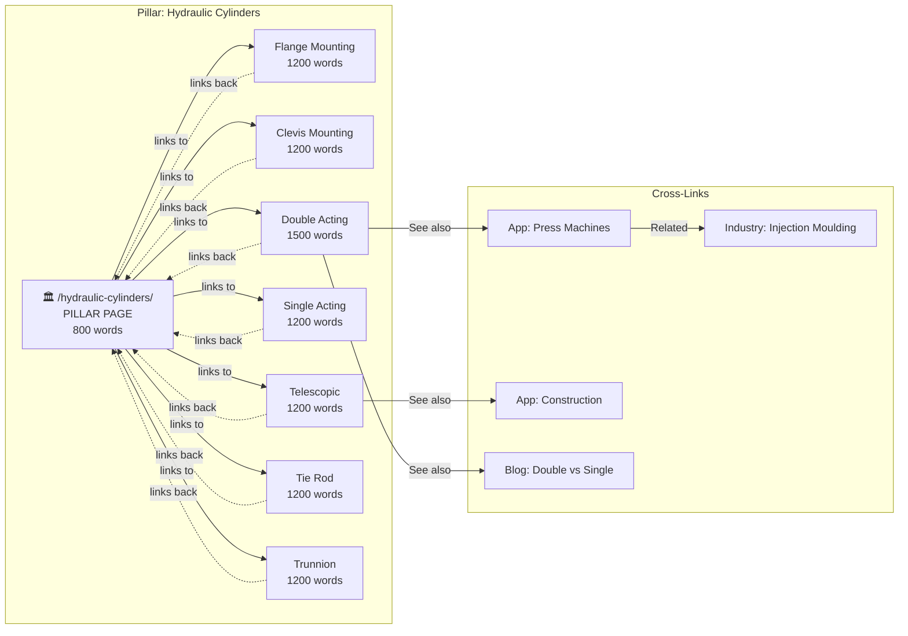

# 🏭 Honeywell Hydraulics — SEO Master Strategy
### From Score 42/100 to #1 in Gujarat

**Prepared for:** Honeywell Hydraulics, Ahmedabad, Gujarat  
**Date:** June 5, 2026  
**Objective:** Rank #1 on Google for commercial buyer keywords across Gujarat and India  

---

## Table of Contents

1. [STEP 1: Business Analysis](#step-1-business-analysis)
2. [STEP 2: Buyer Personas, Industries, Intent & Keywords](#step-2-buyer-personas-industries-intent--keywords)
3. [STEP 3: SEO Strategy, IA, Content & Linking Architecture](#step-3-seo-strategy-ia-content--linking-architecture)
4. [STEP 4: Weaknesses, Competitor Gaps & Ranking Opportunities](#step-4-weaknesses-competitor-gaps--ranking-opportunities)
5. [STEP 5: 6-Month Roadmap to #1](#step-5-6-month-roadmap-to-1)

---

# STEP 1: Business Analysis

## 1.1 Business Profile

| Attribute | Details |
|---|---|
| **Company** | Honeywell Hydraulics |
| **Location** | B-18, Suryam Plaza Estate, Near Nilkanth Estate, Road no. 15, Kathwada GIDC, Ahmedabad, Gujarat 382430 |
| **Founded** | ~2018 |
| **Industry** | Industrial Hydraulic Equipment Manufacturing (B2B) |
| **Revenue Model** | Direct manufacturing + custom fabrication + B2B sales |
| **Contact** | +91 9924343873 · sales@honeywellhydraulics.com |
| **Current Platform** | WordPress 7.0 + Elementor + WooCommerce |
| **Current SEO Score** | 42/100 (Needs Significant Work) |

## 1.2 Product Portfolio

```
Honeywell Hydraulics
├── Hydraulic Cylinders
│   ├── Flange Mounting Cylinder
│   ├── Clevis Mounting Cylinder
│   ├── Trunnion Mounting Cylinder
│   ├── Tie Rod Cylinder
│   ├── Double Acting Cylinder
│   ├── Single Acting Cylinder
│   ├── Telescopic Cylinder
│   └── Application-Specific Cylinders
│       ├── Press Machine Cylinder
│       ├── Car Parking Cylinder
│       ├── Goods Lift Cylinder
│       ├── Passenger Lift Cylinder
│       ├── Scissor Table Cylinder
│       └── Square Body Hydraulic Jack
├── Hydraulic Power Packs
│   ├── 3 Phase Power Pack
│   ├── Single Phase Power Pack
│   ├── Power Pack for Press
│   ├── Power Pack for Lift
│   ├── Power Pack with Accumulator
│   ├── Power Pack with Multiple Solenoid Valve
│   └── Hand Lever Operated Power Pack
├── Manifold Blocks
│   ├── 06 Size Multi Station Block
│   ├── 06 Size Single Station Block
│   ├── 10 Size Single Station Block
│   └── Manifold Block for High Low Systems
└── Custom Hydraulic Systems
    └── (Full system design + integration)
```

## 1.3 Competitive Position in Ahmedabad/Gujarat

| Competitor | Est. Age | Website Quality | SEO Presence | Key Advantage |
|---|---|---|---|---|
| **Zenith Hydromatic Pvt. Ltd.** | 30+ yrs (1994) | Moderate | Strong local | Brand legacy, Pvt. Ltd. trust |
| **Sindhwai Hydraulics Pvt. Ltd.** | 15+ yrs | Good (SEO-focused) | Strong | Active SEO agency partnership |
| **Hydrofit Hydraulics Pvt. Ltd.** | 10+ yrs | Basic | Moderate | IndiaMART presence |
| **Panchal Hydraulic Pvt. Ltd.** | 10+ yrs | Basic | Weak | Price competitor |
| **LEO Engineers (Vadodara)** | 27+ yrs (1997) | Good | Moderate | HYDROFORCES™ brand |
| **Servo Hydraulics** | 10+ yrs | Basic | Weak | Custom machinery |
| **Honeywell Hydraulics** | ~6 yrs | Poor (demo content) | Very Weak | Broad product range |

> [!IMPORTANT]
> **Critical Insight:** Most competitors in the Ahmedabad GIDC hydraulic space have **weak to mediocre websites**. The barrier to ranking #1 is NOT that competitors are strong — it's that Honeywell's current site is actively sabotaging itself with demo content, broken technical SEO, and zero content strategy. Fix the foundation, and you leapfrog 80% of the market.

## 1.4 Market Position SWOT

| | Favorable | Unfavorable |
|---|---|---|
| **Internal** | **Strengths:** Broad product range (cylinders + power packs + manifolds + systems), GIDC location = credibility, existing IndiaMART/Justdial presence, 6+ years operating history | **Weaknesses:** No Pvt. Ltd. suffix (trust signal in India), demo content still on site, no certifications displayed, no blog, broken technical SEO, NAP inconsistency |
| **External** | **Opportunities:** Competitors have weak websites, "Make in India" trend boosts local manufacturing searches, hydraulic industry growing 6-8% CAGR in India, most competitors don't invest in content marketing | **Threats:** B2B aggregators (IndiaMART, TradeIndia) dominate SERP positions, larger competitors (Zenith) have brand legacy, name confusion with Honeywell International |

---

# STEP 2: Buyer Personas, Industries, Intent & Keywords

## 2.1 Buyer Personas

### Persona 1: The Plant Engineer / Procurement Manager
| Attribute | Detail |
|---|---|
| **Title** | Plant Engineer, Maintenance Head, Procurement Manager |
| **Company Size** | Mid-size manufacturing (50–500 employees) |
| **Industry** | Steel, Plastic Moulding, Automotive Components |
| **Budget Authority** | ₹50K – ₹15L per order |
| **Search Behavior** | Searches Google for "hydraulic cylinder manufacturer in Ahmedabad", checks IndiaMART, calls 3-5 vendors for quotes |
| **Decision Criteria** | Quality certification, delivery time, customization ability, local proximity for service |
| **Pain Points** | Unreliable vendors, long lead times, cylinders leaking after 6 months, no after-sales support |
| **Content Needs** | Technical specifications, bore/stroke size charts, material data sheets, installation guides |
| **Conversion Path** | Search → Product page → Spec sheet download → WhatsApp/Call inquiry → Site visit → Order |

### Persona 2: The Machine Builder / OEM Manufacturer
| Attribute | Detail |
|---|---|
| **Title** | Design Engineer, OEM Owner, Technical Director |
| **Company Size** | Small-to-mid machine building firms (10–100 people) |
| **Industry** | Press Machine Builders, Lift System Integrators, Scissor Table Manufacturers |
| **Budget Authority** | ₹2L – ₹50L (recurring, bulk) |
| **Search Behavior** | Searches for specific cylinder types ("double acting hydraulic cylinder manufacturer"), needs technical drawings |
| **Decision Criteria** | Custom bore/stroke capability, consistency across batches, bulk pricing, drawing-to-delivery service |
| **Pain Points** | Needs a reliable long-term supplier, hates quality variance, needs fast prototyping |
| **Content Needs** | CAD drawings, customization process pages, case studies of past OEM work, MOQ information |
| **Conversion Path** | Search → Category page → Specific product → "Request Custom Quote" → Technical call → Sample order → Bulk |

### Persona 3: The Business Owner / Director (New Project)
| Attribute | Detail |
|---|---|
| **Title** | Business Owner, MD, Director |
| **Company Size** | SMEs and new plant setups |
| **Industry** | Any — setting up new production line or expanding facility |
| **Budget Authority** | ₹5L – ₹1Cr+ (full hydraulic system) |
| **Search Behavior** | Searches "hydraulic system manufacturer", "complete hydraulic solution", "hydraulic power pack for press machine" |
| **Decision Criteria** | Turnkey capability, design-to-commissioning, warranty, reputation |
| **Pain Points** | Coordinating multiple vendors, doesn't want to manage individual components |
| **Content Needs** | System case studies, project galleries, "how we work" process pages, video tours |
| **Conversion Path** | Search/Referral → Homepage/About → Solutions page → Case study → Contact/WhatsApp → Site visit → Contract |

### Persona 4: The Maintenance/Repair Buyer (Aftermarket)
| Attribute | Detail |
|---|---|
| **Title** | Maintenance Technician, Store Keeper |
| **Company Size** | Any |
| **Industry** | Any factory with existing hydraulic equipment |
| **Budget Authority** | ₹5K – ₹5L (replacement/repair) |
| **Search Behavior** | "hydraulic cylinder repair Ahmedabad", "hydraulic seal kit supplier", "hydraulic power pack maintenance" |
| **Decision Criteria** | Speed of delivery, availability of spare parts, same-day service |
| **Content Needs** | Troubleshooting guides, maintenance checklists, spare parts catalog |
| **Conversion Path** | Urgent search → Service/repair page → Call immediately |

---

## 2.2 Industries Served (with Keyword Mapping)

| # | Industry Vertical | Hydraulic Products Used | Keyword Cluster |
|---|---|---|---|
| 1 | **Injection Moulding** | Press cylinders, clamping cylinders, power packs | "hydraulic cylinder for injection moulding machine" |
| 2 | **Roto Moulding** | Rotational mould cylinders, power packs | "hydraulic system for roto moulding" |
| 3 | **Press Machine / Metal Forming** | Press cylinders, power packs for press | "hydraulic press cylinder manufacturer" |
| 4 | **Goods Lift / Material Handling** | Lift cylinders, power packs for lift | "hydraulic cylinder for goods lift" |
| 5 | **Passenger Lift / Elevator** | Lift cylinders, power packs | "hydraulic lift cylinder manufacturer" |
| 6 | **Car Parking Systems** | Parking cylinders, power packs | "hydraulic cylinder for car parking system" |
| 7 | **Scissor Table / Lift Table** | Scissor cylinders, power packs | "hydraulic scissor lift table manufacturer" |
| 8 | **Rolling Mill** | Heavy-duty cylinders, high-pressure systems | "hydraulic cylinder for rolling mill" |
| 9 | **Printing Industry** | Precision cylinders | "hydraulic cylinder for printing machine" |
| 10 | **Wooden Machinery** | Press cylinders, clamp cylinders | "hydraulic cylinder for wood press" |
| 11 | **Fly Ash Brick Machinery** | Press cylinders, power packs | "hydraulic cylinder for fly ash brick machine" |
| 12 | **Construction Equipment** | Telescopic cylinders, heavy-duty systems | "hydraulic cylinder for construction equipment" |
| 13 | **Agricultural Equipment** | Telescopic, double-acting cylinders | "hydraulic cylinder manufacturer for agriculture India" |
| 14 | **Steel & Metallurgy** | Mill-type cylinders, high-pressure packs | "hydraulic system for steel plant" |
| 15 | **Automotive OEM** | Custom cylinders for production lines | "hydraulic cylinder supplier for automotive industry" |

---

## 2.3 Commercial Search Intent Classification

### Tier 1: 🔥 Money Keywords (Highest Commercial Intent — Immediate Priority)

These are the keywords buyers type when they're **ready to purchase or request a quote**.

| Keyword | Intent | Est. Monthly Search (India) | Competition | Priority |
|---|---|---|---|---|
| hydraulic cylinder manufacturer in Ahmedabad | Transactional | 200–500 | Medium | 🔥 #1 TARGET |
| hydraulic cylinder manufacturer in Gujarat | Transactional | 100–300 | Medium | 🔥 |
| hydraulic cylinder manufacturer in India | Transactional | 500–1K | High | 🔥 |
| hydraulic power pack manufacturer Ahmedabad | Transactional | 50–150 | Low | 🔥 |
| hydraulic power pack manufacturer India | Transactional | 200–500 | Medium | 🔥 |
| custom hydraulic cylinder manufacturer | Transactional | 100–300 | Medium | 🔥 |
| hydraulic system manufacturer Ahmedabad | Transactional | 30–80 | Low | 🔥 |

### Tier 2: 💰 Product-Specific Keywords (High Commercial Intent)

| Keyword | Intent | Est. Monthly Search | Competition |
|---|---|---|---|
| double acting hydraulic cylinder manufacturer | Transactional | 200–500 | Medium |
| single acting hydraulic cylinder manufacturer | Transactional | 100–300 | Low |
| telescopic hydraulic cylinder manufacturer India | Transactional | 100–200 | Low |
| hydraulic tie rod cylinder manufacturer | Transactional | 50–100 | Low |
| hydraulic cylinder flange mounting | Transactional | 100–200 | Low |
| hydraulic cylinder clevis mounting | Transactional | 50–100 | Low |
| hydraulic cylinder trunnion mounting | Transactional | 30–80 | Low |
| 3 phase hydraulic power pack manufacturer | Transactional | 50–100 | Low |
| single phase hydraulic power pack manufacturer | Transactional | 30–80 | Low |
| hydraulic manifold block manufacturer India | Transactional | 50–150 | Low |

### Tier 3: 🎯 Application-Specific Keywords (High Conversion Potential)

| Keyword | Intent | Est. Monthly Search | Competition |
|---|---|---|---|
| hydraulic cylinder for press machine | Commercial Investigation | 200–500 | Medium |
| hydraulic cylinder for goods lift | Commercial Investigation | 100–200 | Low |
| hydraulic cylinder for passenger lift | Commercial Investigation | 50–150 | Low |
| hydraulic cylinder for car parking | Commercial Investigation | 100–200 | Low |
| hydraulic cylinder for scissor table | Commercial Investigation | 50–100 | Low |
| hydraulic power pack for press | Commercial Investigation | 100–200 | Low |
| hydraulic power pack for lift | Commercial Investigation | 100–200 | Low |
| hydraulic power pack with accumulator | Commercial Investigation | 30–80 | Very Low |

### Tier 4: 🏭 Industry-Specific Keywords (Segment Capture)

| Keyword | Intent | Est. Monthly Search | Competition |
|---|---|---|---|
| hydraulic cylinder for injection moulding | Commercial Investigation | 100–300 | Low |
| hydraulic system for roto moulding machine | Commercial Investigation | 30–80 | Very Low |
| hydraulic cylinder for rolling mill | Commercial Investigation | 50–100 | Low |
| hydraulic press for fly ash brick machine | Commercial Investigation | 100–200 | Low |
| hydraulic cylinder for printing machine | Commercial Investigation | 30–50 | Very Low |
| hydraulic cylinder for construction equipment | Commercial Investigation | 100–300 | Medium |
| hydraulic system for steel plant | Commercial Investigation | 30–80 | Low |

### Tier 5: 📚 Informational Keywords (Content/Blog Targets — Long-Term SEO)

| Keyword | Intent | Est. Monthly Search | Competition |
|---|---|---|---|
| types of hydraulic cylinders | Informational | 1K–3K | Medium |
| how hydraulic cylinder works | Informational | 1K–5K | Medium |
| double acting vs single acting hydraulic cylinder | Informational | 500–1K | Low |
| hydraulic power pack working principle | Informational | 500–1K | Low |
| hydraulic cylinder maintenance guide | Informational | 200–500 | Low |
| how to choose hydraulic cylinder for press | Informational | 100–200 | Very Low |
| hydraulic cylinder bore size selection | Informational | 100–300 | Very Low |
| hydraulic seal types and applications | Informational | 200–500 | Low |
| hydraulic cylinder troubleshooting guide | Informational | 200–500 | Low |
| what is a manifold block in hydraulics | Informational | 100–300 | Very Low |

### Tier 6: 🗺️ Local / Near-Me Keywords

| Keyword | Intent | Est. Monthly Search | Competition |
|---|---|---|---|
| hydraulic cylinder manufacturer near me | Local | 200–500 | Medium |
| hydraulic power pack manufacturer near me | Local | 50–150 | Low |
| hydraulic repair service Ahmedabad | Local | 100–200 | Low |
| hydraulic cylinder supplier Ahmedabad | Local | 50–150 | Low |
| hydraulic equipment supplier Gujarat | Local | 50–150 | Low |
| GIDC hydraulic manufacturer | Local | 10–30 | Very Low |

### Tier 7: 🔍 Long-Tail / Low Competition (Quick Wins)

| Keyword | Intent | Est. Monthly Search | Competition |
|---|---|---|---|
| hydraulic cylinder manufacturer in Kathwada GIDC | Transactional | 0–10 | None |
| hydraulic power pack with solenoid valve manufacturer | Transactional | 10–30 | Very Low |
| hand lever operated hydraulic power pack | Commercial Investigation | 20–50 | Very Low |
| square body hydraulic jack manufacturer India | Transactional | 10–30 | Very Low |
| hydraulic cylinder for car parking system manufacturer Ahmedabad | Transactional | 10–20 | None |
| manifold block for high low system | Commercial Investigation | 10–30 | Very Low |

---

## 2.4 Keyword Opportunity Summary

```
Total Target Keywords: 90+

Distribution:
├── Tier 1 (Money Keywords):        7 keywords  → Homepage + Category Pages
├── Tier 2 (Product-Specific):     10 keywords  → Product Pages
├── Tier 3 (Application-Specific):  8 keywords  → Application Pages
├── Tier 4 (Industry-Specific):     7 keywords  → Industry Landing Pages
├── Tier 5 (Informational/Blog):   10 keywords  → Blog Articles
├── Tier 6 (Local):                 6 keywords  → GMB + Location Pages
└── Tier 7 (Long-Tail):            6+ keywords  → Product Variant Pages

Estimated Total Addressable Search Volume: 8,000–20,000/month (India)
Current Captured Volume: ~0 (virtually no rankings)
```

---

# STEP 3: SEO Strategy, IA, Content & Linking Architecture

## 3.1 Complete SEO Strategy

### 3.1.1 Strategic Pillars

```mermaid
graph TD
    A["🎯 GOAL: #1 for Hydraulic Manufacturer Gujarat"] --> B["Pillar 1: Technical Foundation"]
    A --> C["Pillar 2: Content Dominance"]
    A --> D["Pillar 3: Local Authority"]
    A --> E["Pillar 4: Trust & E-E-A-T"]
    A --> F["Pillar 5: Link Equity"]
    
    B --> B1["Page Speed < 2s LCP"]
    B --> B2["Perfect Schema Markup"]
    B --> B3["Clean Architecture"]
    B --> B4["Mobile-First Build"]
    
    C --> C1["60+ Optimized Pages"]
    C --> C2["Pillar-Cluster Model"]
    C --> C3["Monthly Blog Content"]
    C --> C4["Technical Resources"]
    
    D --> D1["GBP Optimization"]
    D --> D2["NAP Consistency"]
    D --> D3["Local Citations"]
    D --> D4["Gujarat Geo-Targeting"]
    
    E --> E1["Certifications Display"]
    E --> E2["Case Studies"]
    E --> E3["Real Photos/Videos"]
    E --> E4["Author Bios"]
    
    F --> F1["Industry Directories"]
    F --> F2["B2B Platform Links"]
    F --> F3["Association Memberships"]
    F --> F4["Digital PR"]
```



### 3.1.2 On-Page SEO Rules (Every Page)

| Element | Rule |
|---|---|
| **Title Tag** | `[Primary Keyword] [Modifier] | Honeywell Hydraulics` — Max 60 chars |
| **Meta Description** | Include primary keyword + geo + CTA. 150–160 chars. End in complete sentence. |
| **H1** | Exactly 1 per page. Contains primary keyword. Not identical to title tag. |
| **H2s** | 3–6 per page. Each targets a secondary keyword or buyer question. |
| **H3s** | Used under H2s only. Never skip heading levels. |
| **URL** | Lowercase, hyphenated, 3–5 words max. No dates, no IDs. |
| **Internal Links** | Minimum 3 contextual internal links per page (to related products + parent category). |
| **Images** | WebP format, lazy-loaded below fold, keyword-rich alt text, compressed < 100KB. |
| **Word Count** | Product pages: 800–1,500 words. Blog: 1,500–3,000 words. Category pages: 500–800 words. |
| **Schema** | Every page gets the appropriate schema type (see Section 3.1.4). |
| **CTA** | Every page has at least one visible CTA: "Request a Quote", "Call Now", or "WhatsApp Us". |

### 3.1.3 Technical SEO Specifications

| Requirement | Target | Why |
|---|---|---|
| **LCP** | < 2.0s | Google ranking factor (Core Web Vitals) |
| **INP** | < 200ms | Google ranking factor |
| **CLS** | < 0.1 | Google ranking factor |
| **Total Page Weight** | < 1MB | Mobile users in GIDC areas have variable connectivity |
| **CSS Files** | ≤ 3 (1 critical inline + 2 deferred) | Current site loads 33+ CSS files |
| **JS Files** | ≤ 5 (deferred/async) | Eliminate jQuery, particles.js, slick, fancybox |
| **Font Loading** | 1 family (Poppins), preloaded, WOFF2 | Current site loads 4 font families |
| **Image Format** | WebP with AVIF fallback, responsive srcset | Current site uses PNG via Jetpack CDN |
| **HTTPS** | Enforced, HSTS header | Security + ranking signal |
| **Sitemap** | Dynamic XML, submitted to GSC + Bing | Current sitemap is incomplete |
| **robots.txt** | Complete with Sitemap reference + AI crawler rules | Current robots.txt is broken |
| **Canonical Tags** | Self-referencing on every page | Prevent duplicate content |
| **hreflang** | Not needed (single language, single country) | — |
| **Structured Data** | Valid JSON-LD on every page | Rich snippets in SERP |

### 3.1.4 Schema Strategy (Per Page Type)

| Page Type | Schema Types Required |
|---|---|
| **Homepage** | `Organization` + `LocalBusiness` + `WebSite` (with `SearchAction`) + `WebPage` |
| **Product Category Pages** | `CollectionPage` + `BreadcrumbList` + `ItemList` |
| **Individual Product Pages** | `Product` (with `Offer`, `Brand`, `Manufacturer`) + `BreadcrumbList` + `FAQPage` |
| **Industry Pages** | `WebPage` + `BreadcrumbList` + `FAQPage` |
| **Blog Articles** | `Article` + `BreadcrumbList` + `Person` (author) |
| **About Page** | `AboutPage` + `Organization` + `Person` (founders) |
| **Contact Page** | `ContactPage` + `LocalBusiness` (with `PostalAddress`, `GeoCoordinates`) |
| **Gallery/Case Study** | `WebPage` + `ImageObject` + `BreadcrumbList` |

---

## 3.2 Information Architecture (Complete Site Map)

> [!TIP]
> The architecture below is designed around **topic clustering** — each product category becomes a "pillar" page that passes authority to individual product pages, which in turn link back to the pillar. This creates a **semantic silo** that Google rewards with higher topical authority.

### 3.2.1 Full Site Structure

```
honeywellhydraulics.com/
│
├── / (Homepage)
│   Title: "Hydraulic Cylinder & Power Pack Manufacturer in Ahmedabad | Honeywell Hydraulics"
│   H1: "Leading Hydraulic Cylinder Manufacturer in Ahmedabad, Gujarat"
│   Purpose: Money keyword targeting + brand intro + product overview + trust signals
│
├── /about/
│   Title: "About Honeywell Hydraulics | Hydraulic Equipment Manufacturer Since 2018"
│   H1: "About Honeywell Hydraulics — Your Trusted Hydraulic Partner in Gujarat"
│   Purpose: E-E-A-T, company story, team, facility, certifications
│
│
│── PRODUCT PILLAR 1: HYDRAULIC CYLINDERS ──────────────────────
│
├── /hydraulic-cylinders/  (PILLAR PAGE)
│   Title: "Hydraulic Cylinders - Custom Manufacturer in Ahmedabad | Honeywell"
│   H1: "Hydraulic Cylinder Manufacturer in Ahmedabad — Custom & Standard"
│   Purpose: Category overview + internal links to all cylinder types
│   │
│   ├── /hydraulic-cylinders/flange-mounting/
│   │   Title: "Hydraulic Cylinder Flange Mounting | Manufacturer in Gujarat"
│   │
│   ├── /hydraulic-cylinders/clevis-mounting/
│   │   Title: "Hydraulic Cylinder Clevis Mounting | Custom Manufacturer India"
│   │
│   ├── /hydraulic-cylinders/trunnion-mounting/
│   │   Title: "Hydraulic Cylinder Trunnion Mounting | Manufacturer Ahmedabad"
│   │
│   ├── /hydraulic-cylinders/tie-rod/
│   │   Title: "Hydraulic Tie Rod Cylinder | Industrial Manufacturer Gujarat"
│   │
│   ├── /hydraulic-cylinders/double-acting/
│   │   Title: "Double Acting Hydraulic Cylinder | Manufacturer in Ahmedabad"
│   │
│   ├── /hydraulic-cylinders/single-acting/
│   │   Title: "Single Acting Hydraulic Cylinder | Manufacturer in Gujarat"
│   │
│   ├── /hydraulic-cylinders/telescopic/
│   │   Title: "Telescopic Hydraulic Cylinder | Manufacturer India"
│   │
│   └── /hydraulic-cylinders/square-body-jack/
│       Title: "Square Body Hydraulic Jack | Manufacturer Ahmedabad"
│
│
│── PRODUCT PILLAR 2: HYDRAULIC POWER PACKS ──────────────────
│
├── /hydraulic-power-packs/  (PILLAR PAGE)
│   Title: "Hydraulic Power Pack Manufacturer in India | Honeywell Hydraulics"
│   H1: "Hydraulic Power Pack Manufacturer — 3 Phase, Single Phase & Custom"
│   │
│   ├── /hydraulic-power-packs/3-phase/
│   │   Title: "3 Phase Hydraulic Power Pack | Manufacturer Ahmedabad Gujarat"
│   │
│   ├── /hydraulic-power-packs/single-phase/
│   │   Title: "Single Phase Hydraulic Power Pack | Manufacturer India"
│   │
│   ├── /hydraulic-power-packs/for-press/
│   │   Title: "Hydraulic Power Pack for Press Machine | Manufacturer Gujarat"
│   │
│   ├── /hydraulic-power-packs/for-lift/
│   │   Title: "Hydraulic Power Pack for Lift | Manufacturer Ahmedabad"
│   │
│   ├── /hydraulic-power-packs/with-accumulator/
│   │   Title: "Hydraulic Power Pack with Accumulator | Manufacturer India"
│   │
│   ├── /hydraulic-power-packs/solenoid-valve/
│   │   Title: "Hydraulic Power Pack with Solenoid Valve | Multi-Station"
│   │
│   └── /hydraulic-power-packs/hand-lever-operated/
│       Title: "Hand Lever Operated Hydraulic Power Pack | Manufacturer"
│
│
│── PRODUCT PILLAR 3: MANIFOLD BLOCKS ────────────────────────
│
├── /manifold-blocks/  (PILLAR PAGE)
│   Title: "Hydraulic Manifold Block Manufacturer India | Honeywell Hydraulics"
│   H1: "Hydraulic Manifold Block Manufacturer — Custom & Standard"
│   │
│   ├── /manifold-blocks/06-size-multi-station/
│   ├── /manifold-blocks/06-size-single-station/
│   ├── /manifold-blocks/10-size-single-station/
│   └── /manifold-blocks/high-low-system/
│
│
│── PRODUCT PILLAR 4: HYDRAULIC SYSTEMS (NEW — NOT ON CURRENT SITE) ──
│
├── /hydraulic-systems/  (PILLAR PAGE — NEW)
│   Title: "Custom Hydraulic System Manufacturer Ahmedabad | Turnkey Solutions"
│   H1: "Complete Hydraulic System Design & Manufacturing"
│   Purpose: Target Persona 3 (Business Owner wanting full system)
│
│
│── APPLICATION PAGES (NEW — HIGH-VALUE SEO PAGES) ───────────
│
├── /applications/  (Hub Page)
│   Title: "Hydraulic Cylinder Applications | Industry Solutions | Honeywell"
│   │
│   ├── /applications/press-machines/
│   │   Title: "Hydraulic Cylinders for Press Machines | Custom Manufacturer"
│   │   H1: "Hydraulic Cylinder for Press Machine — Design, Specification & Supply"
│   │
│   ├── /applications/goods-lifts/
│   │   Title: "Hydraulic Cylinder for Goods Lift | Manufacturer Ahmedabad"
│   │
│   ├── /applications/passenger-lifts/
│   │   Title: "Hydraulic Cylinder for Passenger Lift | Elevator Manufacturer"
│   │
│   ├── /applications/car-parking-systems/
│   │   Title: "Hydraulic Cylinder for Car Parking System | Manufacturer Gujarat"
│   │
│   ├── /applications/scissor-tables/
│   │   Title: "Hydraulic Cylinder for Scissor Table & Lift | Manufacturer"
│   │
│   └── /applications/construction-equipment/
│       Title: "Hydraulic Cylinders for Construction Equipment | India"
│
│
│── INDUSTRY LANDING PAGES (NEW — SEGMENT-SPECIFIC SEO) ─────
│
├── /industries/  (Hub Page)
│   Title: "Industries We Serve | Hydraulic Solutions by Honeywell"
│   │
│   ├── /industries/injection-moulding/
│   │   Title: "Hydraulic Solutions for Injection Moulding Industry | Manufacturer"
│   │
│   ├── /industries/roto-moulding/
│   │   Title: "Hydraulic Systems for Roto Moulding | Manufacturer Gujarat"
│   │
│   ├── /industries/rolling-mills/
│   │   Title: "Hydraulic Cylinders for Rolling Mill Industry | India"
│   │
│   ├── /industries/printing/
│   │   Title: "Hydraulic Cylinders for Printing Machines | Manufacturer"
│   │
│   ├── /industries/fly-ash-brick/
│   │   Title: "Hydraulic Cylinders for Fly Ash Brick Machinery | Ahmedabad"
│   │
│   ├── /industries/automotive/
│   │   Title: "Hydraulic Solutions for Automotive OEMs | India Manufacturer"
│   │
│   ├── /industries/steel-metallurgy/
│   │   Title: "Hydraulic Systems for Steel & Metallurgy Plants | Gujarat"
│   │
│   └── /industries/wooden-machinery/
│       Title: "Hydraulic Cylinders for Wooden Machinery | Manufacturer"
│
│
│── TRUST & CONVERSION PAGES ─────────────────────────────────
│
├── /clients/
│   Title: "Our Clients | Trusted by 200+ Manufacturers Across India"
│   Purpose: Social proof, logo wall, industry breakdown
│
├── /case-studies/  (NEW)
│   Title: "Hydraulic Project Case Studies | Honeywell Hydraulics"
│   Purpose: E-E-A-T, demonstrate expertise, long-tail keywords
│   │
│   ├── /case-studies/injection-moulding-press-ahmedabad/
│   ├── /case-studies/car-parking-system-surat/
│   └── /case-studies/goods-lift-system-vadodara/
│
├── /gallery/
│   Title: "Product & Factory Gallery | Honeywell Hydraulics Ahmedabad"
│   Purpose: Visual proof, image SEO (Google Images traffic)
│
├── /downloads/  (ENHANCED)
│   Title: "Technical Downloads | Catalogs & Spec Sheets | Honeywell Hydraulics"
│   Purpose: Lead generation (gated PDFs), authority building
│
├── /certifications/  (NEW)
│   Title: "Quality Certifications & Standards | Honeywell Hydraulics"
│   Purpose: E-E-A-T, ISO/quality display
│
│
│── CONTENT / BLOG (NEW — CRITICAL FOR RANKING) ──────────────
│
├── /blog/  (Blog Index)
│   Title: "Hydraulic Engineering Blog | Technical Guides | Honeywell"
│   │
│   ├── /blog/types-of-hydraulic-cylinders-complete-guide/
│   ├── /blog/double-acting-vs-single-acting-hydraulic-cylinder/
│   ├── /blog/how-to-choose-hydraulic-cylinder-for-press-machine/
│   ├── /blog/hydraulic-power-pack-working-principle/
│   ├── /blog/hydraulic-cylinder-maintenance-guide/
│   ├── /blog/hydraulic-cylinder-bore-size-selection-chart/
│   ├── /blog/hydraulic-seal-types-and-applications/
│   ├── /blog/what-is-manifold-block-in-hydraulics/
│   ├── /blog/hydraulic-cylinder-troubleshooting-common-problems/
│   └── /blog/hydraulic-vs-pneumatic-cylinder-difference/
│
│
│── UTILITY PAGES ────────────────────────────────────────────
│
├── /contact/
│   Title: "Contact Us | Honeywell Hydraulics Ahmedabad | Get a Quote"
│   Purpose: Contact form + map + WhatsApp + lead capture
│
├── /request-quote/  (NEW — Dedicated CTA Page)
│   Title: "Request a Free Quote | Hydraulic Cylinder & Power Pack"
│   Purpose: High-conversion landing page for CTAs across the site
│
├── /privacy-policy/
├── /terms-conditions/
├── /sitemap/  (HTML sitemap)
│
│
│── TECHNICAL FILES ──────────────────────────────────────────
│
├── /robots.txt
├── /sitemap.xml (dynamic XML)
├── /llms.txt (AI search visibility)
└── /.well-known/security.txt
```

### 3.2.2 Page Count Summary

| Section | # Pages | Status |
|---|---|---|
| Core Pages (Home, About, Contact, etc.) | 6 | Rebuild from existing |
| Hydraulic Cylinders (Pillar + Products) | 9 | Rebuild + optimize |
| Hydraulic Power Packs (Pillar + Products) | 8 | Rebuild + optimize |
| Manifold Blocks (Pillar + Products) | 5 | Rebuild + optimize |
| Hydraulic Systems (Pillar) | 1 | **NEW** |
| Application Pages | 7 | **NEW** (partially rebuild from existing product-use pages) |
| Industry Landing Pages | 9 | **NEW** |
| Case Studies | 3+ | **NEW** |
| Blog Articles (initial) | 10 | **NEW** |
| Utility Pages | 5 | Standard |
| **TOTAL** | **63+** | — |

---

## 3.3 Content Architecture — Pillar-Cluster Model

### 3.3.1 How Pillar-Cluster Works for Honeywell



### 3.3.2 Content Templates

#### Product Page Template (Each of the ~22 product pages)

```
SECTION 1: Hero + H1
├── H1: "[Product Name] — Manufacturer in Ahmedabad"
├── 1-line value proposition
├── CTA: "Request a Quote" + "Download Spec Sheet"
└── Hero product image (WebP, alt text optimized)

SECTION 2: Product Overview (200–300 words)
├── H2: "What is [Product Name]?"
├── Clear technical description
├── Key specifications table (bore size, stroke, pressure, mounting)
└── Internal link to parent category page

SECTION 3: Features & Advantages (200–300 words)
├── H2: "Features & Advantages of Our [Product]"
├── Bullet list of 6–8 features
├── Comparison to alternatives where relevant
└── Internal link to related products

SECTION 4: Applications (200–300 words)
├── H2: "Applications of [Product Name]"
├── Industry-specific use cases with links to /applications/ pages
└── Internal links to /industries/ pages

SECTION 5: Specifications Table
├── H2: "Technical Specifications"
├── Full spec table: bore range, stroke range, pressure rating, mounting type, material, finish
└── "Custom sizes available — Contact us for specifications"

SECTION 6: Why Choose Honeywell (150 words)
├── H2: "Why Choose Honeywell Hydraulics for [Product]?"
├── Trust signals: years, clients served, custom capability, delivery time
└── CTA: "Get a Free Quote Today"

SECTION 7: FAQ (3–5 questions)
├── H2: "Frequently Asked Questions"
├── Q&A targeting long-tail search queries
└── FAQPage schema markup

SECTION 8: Related Products
├── H2: "Related Hydraulic Products"
├── 3–4 product cards with thumbnail, name, link
└── Links to other product pages within the pillar

Total: 800–1,500 words of unique, keyword-rich content per product page
```

#### Industry Landing Page Template (Each of the 8 industry pages)

```
SECTION 1: Hero + H1
├── H1: "Hydraulic Solutions for [Industry Name]"
├── Industry-specific value proposition
└── Industry-relevant hero image

SECTION 2: Industry Challenges (200 words)
├── H2: "Hydraulic Challenges in the [Industry] Industry"
├── Specific pain points this industry faces
└── How hydraulic solutions address them

SECTION 3: Products for This Industry (300 words)
├── H2: "Our Hydraulic Products for [Industry]"
├── List products used in this industry with links to product pages
├── Specification requirements specific to this industry
└── Internal links to product pillar pages

SECTION 4: Case Study Snippet (200 words)
├── H2: "Case Study: [Specific Project in Industry]"
├── Brief project description
├── Results achieved
└── Link to full case study

SECTION 5: Why Honeywell for [Industry] (150 words)
├── Trust signals relevant to this industry
└── CTA: "Discuss Your [Industry] Requirements"

SECTION 6: FAQ (3–5 questions)
├── Industry-specific questions
└── FAQPage schema

Total: 800–1,200 words per industry page
```

#### Blog Article Template (Each of the 10+ articles)

```
SECTION 1: Introduction (150 words)
├── Hook: industry problem or common question
├── What this guide covers
└── Internal link to relevant product page

SECTION 2–5: Core Content (1,000–2,000 words)
├── Multiple H2 and H3 subsections
├── Technical depth with diagrams/images
├── Comparison tables where relevant
├── Internal links to product pages and application pages
└── External links to authoritative sources (ISO standards, etc.)

SECTION 6: Conclusion + CTA (100 words)
├── Summary
├── CTA: "Need a [product] for your application?"
└── Link to /request-quote/

SECTION 7: Author Bio
├── Real person (founder/engineer)
├── Photo + credentials
└── Person schema markup

Total: 1,500–3,000 words per blog article
```

---

## 3.4 Internal Linking Architecture

> [!IMPORTANT]
> Internal linking is the **most underrated ranking factor** for B2B industrial sites. It distributes PageRank, establishes topical relevance, and guides Googlebot through your content silo. The current site has almost zero strategic internal linking.

### 3.4.1 Link Architecture Rules

| Rule | Description |
|---|---|
| **Rule 1: Every page links UP** | Every product page links back to its parent category (pillar) page |
| **Rule 2: Every page links DOWN** | Every category page links to all its child product pages |
| **Rule 3: Cross-silo linking** | Product pages link to relevant application pages and industry pages |
| **Rule 4: Blog → Product** | Every blog article includes at least 2 contextual links to relevant product pages |
| **Rule 5: Homepage equity** | Homepage links to all 4 product pillar pages + top 2 industry pages |
| **Rule 6: Footer links** | Footer contains links to all pillar pages + contact + request quote |
| **Rule 7: Breadcrumbs** | Every page has visible breadcrumbs with BreadcrumbList schema |
| **Rule 8: Contextual anchor text** | Use keyword-rich anchor text, not "click here" or "learn more" |
| **Rule 9: Related products** | Every product page shows 3–4 related products |
| **Rule 10: CTA pages** | Every content page links to /request-quote/ or /contact/ |

### 3.4.2 Internal Link Flow Diagram

```mermaid
graph TD
    HOME["🏠 Homepage<br/>(Highest Authority)"]
    
    HOME -->|"Hydraulic Cylinders"| CYL["🏛️ /hydraulic-cylinders/<br/>PILLAR"]
    HOME -->|"Power Packs"| PP["🏛️ /hydraulic-power-packs/<br/>PILLAR"]
    HOME -->|"Manifold Blocks"| MB["🏛️ /manifold-blocks/<br/>PILLAR"]
    HOME -->|"Hydraulic Systems"| SYS["🏛️ /hydraulic-systems/<br/>PILLAR"]
    HOME -->|"Industries"| IND["📂 /industries/"]
    HOME -->|"About"| ABOUT["📄 /about/"]
    
    CYL -->|links to each| CYL_PROD["8 Cylinder Products"]
    PP -->|links to each| PP_PROD["7 Power Pack Products"]
    MB -->|links to each| MB_PROD["4 Manifold Products"]
    
    CYL_PROD -->|"Application links"| APP["📂 /applications/<br/>6 Application Pages"]
    PP_PROD -->|"Application links"| APP
    
    APP -->|"Industry links"| IND_PAGES["📂 /industries/<br/>8 Industry Pages"]
    
    IND_PAGES -->|"Product links"| CYL_PROD
    IND_PAGES -->|"Product links"| PP_PROD
    
    BLOG["📝 /blog/<br/>10+ Articles"] -->|"Product links"| CYL_PROD
    BLOG -->|"Product links"| PP_PROD
    BLOG -->|"Application links"| APP
    
    CYL_PROD -->|"Back to pillar"| CYL
    PP_PROD -->|"Back to pillar"| PP
    MB_PROD -->|"Back to pillar"| MB
    
    CASE["📋 /case-studies/"| -->|"Product links"| CYL_PROD
    CASE -->|"Industry links"| IND_PAGES
    
    ALL["ALL PAGES"] -->|"CTA link"| QUOTE["💰 /request-quote/"]
    ALL -->|"Footer links"| CONTACT["📞 /contact/"]
```

### 3.4.3 Anchor Text Strategy

| Link Destination | Recommended Anchor Text Variants |
|---|---|
| /hydraulic-cylinders/ | "hydraulic cylinders", "our hydraulic cylinder range", "cylinder products" |
| /hydraulic-cylinders/double-acting/ | "double acting hydraulic cylinder", "double-acting cylinders", "our double acting cylinders" |
| /hydraulic-power-packs/ | "hydraulic power packs", "power pack range", "our power packs" |
| /applications/press-machines/ | "hydraulic cylinders for press machines", "press machine applications", "press machine solutions" |
| /industries/injection-moulding/ | "injection moulding industry", "injection moulding hydraulic solutions" |
| /request-quote/ | "request a free quote", "get a quote", "contact us for pricing" |
| /blog/types-of-hydraulic-cylinders/ | "learn about hydraulic cylinder types", "our complete guide to cylinder types" |

### 3.4.4 Navigation Structure

```
PRIMARY NAV:
├── Home
├── Products ▾
│   ├── Hydraulic Cylinders →
│   │   ├── Flange Mounting
│   │   ├── Clevis Mounting
│   │   ├── Trunnion Mounting
│   │   ├── Tie Rod
│   │   ├── Double Acting
│   │   ├── Single Acting
│   │   ├── Telescopic
│   │   └── Square Body Jack
│   ├── Hydraulic Power Packs →
│   │   ├── 3 Phase
│   │   ├── Single Phase
│   │   ├── For Press
│   │   ├── For Lift
│   │   ├── With Accumulator
│   │   ├── With Solenoid Valve
│   │   └── Hand Lever Operated
│   ├── Manifold Blocks →
│   │   ├── 06 Size Multi Station
│   │   ├── 06 Size Single Station
│   │   ├── 10 Size Single Station
│   │   └── High Low System
│   └── Hydraulic Systems
├── Applications ▾
│   ├── Press Machines
│   ├── Goods Lifts
│   ├── Passenger Lifts
│   ├── Car Parking Systems
│   ├── Scissor Tables
│   └── Construction Equipment
├── Industries ▾
│   ├── Injection Moulding
│   ├── Roto Moulding
│   ├── Rolling Mills
│   ├── Steel & Metallurgy
│   ├── Automotive
│   ├── Printing
│   ├── Fly Ash Brick
│   └── Wooden Machinery
├── Resources ▾
│   ├── Blog
│   ├── Case Studies
│   ├── Gallery
│   ├── Downloads
│   └── Certifications
├── About
└── Contact / Get a Quote 🟢 (highlighted CTA button)

FOOTER NAV:
├── Quick Links: Home | About | Contact | Request Quote
├── Products: Hydraulic Cylinders | Power Packs | Manifold Blocks | Systems
├── Industries: (all 8 industry pages)
├── Resources: Blog | Case Studies | Gallery | Downloads
├── Contact Info: Address | Phone | Email | Map
└── Legal: Privacy Policy | Terms | Sitemap
```

---

# STEP 4: Weaknesses, Competitor Gaps & Ranking Opportunities

## 4.1 Current Weaknesses (Prioritized)

### 🔴 Critical Weaknesses (Blocking Rankings)

| # | Weakness | Impact on Rankings | Evidence |
|---|---|---|---|
| 1 | **Homepage title = just "Honeywell Hydraulics"** | Wasting the #1 on-page ranking signal — targets zero search queries | FULL-AUDIT-REPORT.md |
| 2 | **Demo/Lorem ipsum content still on site** | Google's Helpful Content System (HCU) penalizes sites with unhelpful/fake content. This destroys E-E-A-T. | Lorem ipsum found in "Our Technical Solutions", "Yacht Build Package", template project names |
| 3 | **NAP inconsistency (two different addresses)** | Confuses Google's local algorithm, reduces Local Pack ranking eligibility | Schema = Pelican Estate; Header = Suryam Plaza |
| 4 | **No H1 tags on ANY product page** | Google uses H1 as a strong topical relevance signal. Zero H1s = zero topical signals on product pages | SITE-INVENTORY.txt shows H1: N/A on 33 of 34 pages |
| 5 | **33+ CSS files, broken minification** | LCP > 3.5s, Google CWV is a ranking factor since June 2021 | WP-Optimize cache write error in page source |
| 6 | **External link leak to layout.co.in** | Passing PageRank/authority to an unrelated domain instead of keeping it | Product grid links to layout.co.in for mobile |
| 7 | **Duplicate Google Analytics tags** | Double-counting sessions corrupts data, makes optimization decisions unreliable | GT-PLFQ88JR + G-KPRQJXS2R3 both firing |

### 🟠 High Weaknesses (Limiting Growth)

| # | Weakness | Impact |
|---|---|---|
| 8 | **No blog / educational content** | Cannot rank for informational keywords (8,000+ monthly searches), no topical authority building |
| 9 | **No Product schema on product pages** | Missing rich snippets in SERP (competitor advantage) |
| 10 | **Every product image alt = "Honeywell Hydraulics"** | Wasting image SEO signals on 20+ images; missing Google Images traffic |
| 11 | **No industry-specific landing pages** | Cannot capture segment-specific searches ("hydraulic for injection moulding") |
| 12 | **No case studies or project galleries** | Zero proof of work, severely damages E-E-A-T |
| 13 | **Flat URL structure** | No semantic silos; products not nested under categories |
| 14 | **Article schema on homepage** | Sends wrong signals to Google; homepage is not an article |
| 15 | **No BreadcrumbList schema** | Missing breadcrumb rich snippets in search results |

### 🟡 Medium Weaknesses (Preventing Excellence)

| # | Weakness | Impact |
|---|---|---|
| 16 | **No certifications/quality standards displayed** | Indian B2B buyers expect ISO, BIS certifications |
| 17 | **No author bios** (content by "AdminHoneywell") | E-E-A-T requires identifiable, credentialed authors |
| 18 | **No sameAs links in Organization schema** | Google can't connect website entity to IndiaMART, GMB, etc. |
| 19 | **No security headers** | Minor trust/ranking signal, but indicates technical neglect |
| 20 | **No llms.txt or AI search optimization** | Missing emerging AI search citation opportunities |
| 21 | **Meta descriptions truncated or missing** | Poor CTR in SERP, some pages have no meta description |
| 22 | **Stale About page** (last modified Dec 2022) | Signals an abandoned/low-maintenance site |
| 23 | **No Google Reviews widget or GBP embed** | Missing social proof that converts visitors |
| 24 | **Hotlinked images from nauthemes.com** | Third-party dependency, potential broken images |

---

## 4.2 Competitor Gap Analysis

### 4.2.1 What Competitors Are Doing (That Honeywell Is Not)

| Competitor | What They Do Better | Honeywell's Gap |
|---|---|---|
| **Zenith Hydromatic** | 30+ year brand story, consistent NAP, Justdial presence, clear product catalog | Honeywell has no brand story, inconsistent NAP, demo content |
| **Sindhwai Hydraulics** | Active SEO agency partnership, structured product catalog, mentions of exporter credentials | Honeywell has no SEO strategy, no export positioning |
| **IndiaMART listings** | Dominate SERP for "manufacturer" queries, have reviews, verified seller badges | Honeywell's own website cannot compete with aggregators yet |
| **Industry-adjacent sites** | Some competitors have technical blogs, maintenance guides | Honeywell has zero content |

### 4.2.2 What NO Competitor Is Doing (Biggest Opportunities)

> [!TIP]
> These are the gaps where **nobody** in the Ahmedabad hydraulic market is investing. First-mover advantage is massive.

| Opportunity | Why Nobody Does It | Honeywell's Advantage If Done |
|---|---|---|
| **Technical blog with 10+ articles** | Most hydraulic manufacturers don't invest in content marketing | Captures 8,000+ informational searches/month; builds topical authority; feeds Google Discover |
| **Industry-specific landing pages** | Competitors use one-size-fits-all product pages | Captures segment-specific searches; increases relevance per query |
| **Application-specific pages** | Competitors list products but don't explain use cases | Matches exact buyer search intent ("hydraulic cylinder for press machine") |
| **Case studies with real photos** | Competitors are shy about sharing project details | Strongest E-E-A-T signal possible; builds unbeatable trust |
| **Video content (YouTube + embedded)** | Almost no hydraulic manufacturer in Gujarat has product videos | YouTube is the 2nd largest search engine; video schema enables rich snippets |
| **AI search optimization (llms.txt)** | Emerging technology; nobody in this niche is doing it | Early mover advantage for ChatGPT, Perplexity, Gemini citations |
| **Comprehensive schema markup** | Most competitors have zero or broken schema | Rich snippets (stars, pricing, availability) in SERP = higher CTR |
| **Request-a-quote landing page** | Competitors bury contact forms | Dedicated conversion page increases lead capture by 2–5x |

---

## 4.3 Ranking Opportunities (Prioritized by ROI)

### 4.3.1 Quick Wins (0–30 days, minimal effort, immediate impact)

| Opportunity | Effort | Expected Impact |
|---|---|---|
| Fix homepage title tag → "Hydraulic Cylinder Manufacturer in Ahmedabad \| Honeywell Hydraulics" | 5 min | +5–15 SERP positions for primary keyword |
| Add H1 to every product page | 2 hrs | +3–10 positions per product keyword |
| Fix all image alt texts with keywords | 1 hr | Google Images traffic + on-page relevance signal |
| Remove demo content | 3 hrs | HCU recovery, E-E-A-T improvement |
| Fix robots.txt + add sitemap reference | 10 min | Improved crawl efficiency |
| Remove duplicate GA4 tag | 10 min | Clean data for optimization |
| Fix NAP inconsistency | 30 min | Local Pack eligibility restored |

### 4.3.2 Medium-Term Wins (30–90 days, moderate effort)

| Opportunity | Effort | Expected Impact |
|---|---|---|
| Rebuild all product pages with 800–1,500 word optimized content | 40 hrs | Rank for all Tier 2 product keywords |
| Create 8 industry landing pages | 30 hrs | Capture Tier 4 industry-specific search traffic |
| Create 6 application pages | 20 hrs | Capture Tier 3 application-specific searches |
| Implement complete schema strategy | 10 hrs | Rich snippets in SERP (stars, breadcrumbs, products) |
| Launch blog with 5 cornerstone articles | 25 hrs | Begin capturing Tier 5 informational traffic |
| GBP optimization + review solicitation | 5 hrs | Local Pack ranking improvement |
| Build 20+ local citations | 10 hrs | Local SEO authority boost |

### 4.3.3 Long-Term Wins (90–180 days, sustained effort)

| Opportunity | Effort | Expected Impact |
|---|---|---|
| Publish 2–4 blog articles per month | Ongoing | Compound traffic growth, topical authority |
| Create 5+ detailed case studies | 15 hrs | E-E-A-T boost, long-tail keyword capture |
| Build 30+ backlinks from industry directories, associations | Ongoing | Domain authority growth |
| Video content program (YouTube channel) | Ongoing | Video SERP features, YouTube search traffic |
| Digital PR (industry publications) | Ongoing | High-authority backlinks, brand mentions |

---

# STEP 5: 6-Month Roadmap to #1

## Month 0 (Pre-Launch): Foundation — "Fix Everything Broken"

> **Goal:** Clean slate. Remove all technical debt. Prepare for the new build.

| Week | Tasks | Owner |
|---|---|---|
| **Week 1** | ✅ Decide correct business address (NAP) | Business Owner |
| | ✅ Gather real company photos: factory, team, products, projects | Business Owner |
| | ✅ List all certifications, quality standards, memberships | Business Owner |
| | ✅ Identify 3–5 real completed projects for case studies | Business Owner |
| | ✅ Write founder/key person bio (200–300 words) | Business Owner |
| **Week 2** | ✅ Finalize information architecture (this document) | SEO Strategist |
| | ✅ Create keyword-to-page mapping (assign 1–2 keywords per page) | SEO Strategist |
| | ✅ Write all title tags and meta descriptions for 63+ pages | SEO Strategist |
| | ✅ Create content briefs for all product, application, and industry pages | SEO Strategist |

---

## Month 1: Build — "Launch the New Foundation"

> **Goal:** New website live with correct technical SEO, optimized core pages, and perfect schema.

| Week | Tasks | KPIs |
|---|---|---|
| **Week 1–2** | Build new website (static HTML or lightweight framework — NO WordPress bloat) | Site loads < 2s LCP |
| | Implement all technical SEO specs (Section 3.1.3) | CWV all green |
| | Set up proper robots.txt, XML sitemap, canonical tags | GSC coverage clean |
| | Implement all schema markup (Section 3.1.4) | Schema validation passes |
| **Week 3** | Publish all product pages (22 pages) with optimized content | All pages indexed |
| | Publish core pages: Homepage, About, Contact, Clients, Gallery | — |
| | Implement internal linking architecture | 3+ internal links per page |
| | Set up GA4 (single tag) + GSC | Tracking verified |
| **Week 4** | Publish application pages (6 pages) | Pages indexed in 7 days |
| | Publish industry landing pages (8 pages) | — |
| | Submit sitemap to Google Search Console + Bing | Sitemap accepted |
| | Set up /request-quote/ conversion page | Form submissions tracked |
| | Deploy llms.txt | — |
| | **QA:** Test every page: title, H1, schema, speed, mobile, links | All checks pass |

**Month 1 KPI Targets:**
- 63+ pages live and indexed
- LCP < 2.0s on all pages
- Schema valid on all pages
- GSC showing 0 errors

---

## Month 2: Content — "Start the Content Engine"

> **Goal:** Launch blog. Publish first cornerstone articles. Begin capturing informational traffic.

| Week | Tasks | KPIs |
|---|---|---|
| **Week 5** | Publish blog article: "Types of Hydraulic Cylinders — Complete Guide" (2,000+ words) | Indexed within 48 hrs |
| | Publish blog article: "Double Acting vs Single Acting Hydraulic Cylinder" (1,500 words) | — |
| **Week 6** | Publish blog article: "How to Choose a Hydraulic Cylinder for Press Machine" (1,500 words) | — |
| | Publish blog article: "Hydraulic Power Pack Working Principle" (1,500 words) | — |
| **Week 7** | Publish 1st case study: "Injection Moulding Press System — Ahmedabad Client" | — |
| | Publish blog article: "Hydraulic Cylinder Maintenance Guide" (2,000 words) | — |
| **Week 8** | Publish 2nd case study | — |
| | Publish /certifications/ page with real quality documentation | — |
| | Begin GBP optimization: update categories, add photos, request reviews | GBP profile complete |

**Month 2 KPI Targets:**
- 5 blog articles published and indexed
- 2 case studies live
- GBP fully optimized
- First organic impressions appearing in GSC

---

## Month 3: Authority — "Build Trust Signals & Links"

> **Goal:** Begin link building. Strengthen E-E-A-T. Start ranking for long-tail keywords.

| Week | Tasks | KPIs |
|---|---|---|
| **Week 9** | Build 10 local citations (IndiaMART, Justdial, TradeIndia, Sulekha, Yellow Pages India, ExportersIndia, Go4WorldBusiness, IndiaBizClub, Dial4Trade, Google Maps) | All citations live with consistent NAP |
| **Week 10** | Publish 2 more blog articles | 7 total articles |
| | Build 5 industry directory links (Gujarat Industrial Directory, GIDC directory, engineering forums) | DA boost |
| **Week 11** | Publish 3rd case study | — |
| | Reach out to 10 industry blogs/publications for guest posts or mentions | 2–3 backlinks secured |
| **Week 12** | Publish 2 more blog articles | 9 total articles |
| | Start YouTube channel: upload 2–3 product videos | Videos indexed |
| | Solicit 10 Google reviews from existing clients | 5+ reviews received |

**Month 3 KPI Targets:**
- 15+ local citations
- 5+ backlinks from industry directories
- 9 blog articles indexed
- First page 2–3 rankings for long-tail keywords
- 200+ daily organic impressions in GSC

---

## Month 4: Optimization — "Analyze & Improve"

> **Goal:** Use GSC and GA4 data to optimize. Double down on what's working.

| Week | Tasks |
|---|---|
| **Week 13–14** | Analyze GSC: identify pages ranking 5–20 → optimize those pages for position improvements |
| | Analyze GA4: identify highest-converting pages → replicate patterns |
| | Update meta descriptions on pages with < 3% CTR |
| | Add new FAQ sections to product pages based on GSC "queries" showing impressions |
| **Week 15–16** | Publish 3 new blog articles targeting gaps found in GSC data |
| | Build 5 more backlinks via guest posts / industry features |
| | Create downloadable resources: PDF catalog, spec sheet, buying guide (for lead gen) |

**Month 4 KPI Targets:**
- 5+ pages ranking on page 1 for long-tail keywords
- 500+ daily organic impressions
- 10+ monthly leads from organic search
- 12 blog articles total

---

## Month 5: Scale — "Expand Content & Dominate Long-Tail"

| Week | Tasks |
|---|---|
| **Week 17–18** | Publish 4 new blog articles (advanced topics: "Hydraulic Cylinder Bore Size Selection Chart", "Hydraulic Seal Types", "Troubleshooting Guide", "What is a Manifold Block") |
| | Create 2 more case studies |
| | Launch "Hydraulic Calculator" tool page (bore size calculator) — link magnet |
| **Week 19–20** | Build 10 more backlinks |
| | Update all existing content with fresh data, new photos |
| | Begin targeting Tier 1 money keywords aggressively (homepage + category pages optimization) |

**Month 5 KPI Targets:**
- 10+ pages ranking on page 1
- 1,000+ daily organic impressions
- 20+ monthly leads from organic
- 16+ blog articles total

---

## Month 6: Dominate — "Target #1 Position"

| Week | Tasks |
|---|---|
| **Week 21–22** | Full content audit: update all 63+ pages based on 5 months of data |
| | Add comparison pages: "Honeywell vs [Competitor]" (if appropriate) |
| | Implement heatmap analysis on key product pages (Hotjar/Clarity) |
| | A/B test CTAs on /request-quote/ page |
| **Week 23–24** | Final push: build 10 high-quality backlinks |
| | Publish comprehensive "Hydraulic Cylinder Buying Guide for Indian Industries" (3,000+ words) — ultimate link magnet |
| | Submit for industry awards / press coverage |
| | Full performance audit and next 6-month plan |

**Month 6 KPI Targets:**
- **Primary keyword "Hydraulic Cylinder Manufacturer in Ahmedabad" → Top 3**
- 15+ pages ranking on page 1
- 2,000+ daily organic impressions
- 30+ monthly leads from organic
- 20+ blog articles
- 30+ quality backlinks

---

## KPI Tracking Dashboard

| Metric | Month 1 | Month 2 | Month 3 | Month 4 | Month 5 | Month 6 |
|---|---|---|---|---|---|---|
| Pages Indexed | 63 | 70 | 80 | 85 | 95 | 100+ |
| Daily Organic Impressions | 50 | 150 | 300 | 500 | 1,000 | 2,000+ |
| Daily Organic Clicks | 3 | 10 | 25 | 50 | 100 | 200+ |
| Page 1 Rankings | 0 | 1 | 5 | 10 | 15 | 20+ |
| Monthly Organic Leads | 0 | 2 | 5 | 10 | 20 | 30+ |
| Blog Articles Published | 0 | 5 | 9 | 12 | 16 | 20+ |
| Quality Backlinks | 0 | 0 | 15 | 20 | 30 | 40+ |
| Google Reviews | ? | 5 | 10 | 15 | 20 | 25+ |
| LCP (seconds) | < 2.0 | < 2.0 | < 2.0 | < 1.5 | < 1.5 | < 1.5 |
| SEO Score | 75 | 80 | 85 | 88 | 90 | 92+ |

---

## Final Strategic Recommendations

> [!CAUTION]
> ### The #1 Mistake to Avoid
> **Do NOT rebuild this website on WordPress + Elementor + WooCommerce again.** The current stack is the root cause of:
> - 33+ CSS files loading (Elementor generates excessive CSS)
> - Broken minification (WP-Optimize conflicts)
> - WooCommerce scripts loading on non-shop pages
> - jQuery + jQuery Migrate (unnecessary overhead)
> - Plugin conflicts and security vulnerabilities
>
> **Recommended stack for new build:**
> - **Static HTML + minimal CSS/JS** (fastest possible) OR
> - **Next.js / Astro** (if dynamic features needed) with static export
> - **Cloudflare Pages or Vercel** for hosting (free tier, global CDN, < 100ms TTFB)
> - **No WordPress, no Elementor, no WooCommerce** unless you specifically need e-commerce checkout

> [!IMPORTANT]
> ### The Name "Honeywell" Problem
> **Honeywell International** is a Fortune 100 company. Sharing the name "Honeywell Hydraulics" creates two issues:
> 1. **Search confusion** — Google may struggle to differentiate entities
> 2. **Trademark risk** — Potential legal issues
>
> **SEO Mitigation:** Always pair the name with geo-modifiers ("Honeywell Hydraulics Ahmedabad") and ensure your `Organization` schema is distinct from Honeywell International. Build strong sameAs links to your own directories.

> [!TIP]
> ### The Multiplier Effect
> If you execute this strategy consistently for 6 months:
> - **Every blog article** you publish makes every other page on your site stronger (topical authority)
> - **Every backlink** you earn raises the ranking ceiling for all pages
> - **Every review** you collect improves your Local Pack position
> - **Every case study** you publish gives Google more E-E-A-T signals
>
> The compound effect of doing ALL of these together is 10x more powerful than doing any one alone.

---

*Strategy prepared by Antigravity AI — June 5, 2026*  
*Based on full SEO audit (42/100), site inventory (34 pages), and competitive analysis of Ahmedabad hydraulic market*
