# 🧩 Honeywell Hydraulics — UI Component Library
### Production-Ready Component Documentation

**Synthesized from:** Design System · Homepage Wireframe · Website Architecture · Technical SEO Spec · Content Strategy
**Skills Applied:** Emil Kowalski · Impeccable · Taste Skill · Anthropic Frontend
**Design Tokens:** Defined in [honeywell-design-system.md](file:///c:/Users/DELL/Desktop/Honeywell%20Seo/docs/ui/honeywell-design-system.md)

---

## Table of Contents

1. [Header](#1-header)
2. [Navigation & Mega Menu](#2-navigation--mega-menu)
3. [Hero](#3-hero)
4. [Product Cards](#4-product-cards)
5. [Industry Cards](#5-industry-cards)
6. [Statistics / Trust Bar](#6-statistics--trust-bar)
7. [Testimonials](#7-testimonials)
8. [CTA Sections](#8-cta-sections)
9. [Forms](#9-forms)
10. [FAQ / Accordion](#10-faq--accordion)
11. [Footer](#11-footer)
12. [Shared Primitives](#12-shared-primitives)

---

# 1. HEADER

## Component Name
`<SiteHeader />`

## Purpose
Persistent brand identification, primary navigation, and always-visible CTA. Anchors every page.

---

### 1.1 Variants

| Variant | When Used | Visual Treatment |
|---|---|---|
| **Default (Transparent)** | Pages with dark hero (Homepage, dark-topped pages) | `background: transparent`, white logo, white nav text |
| **Solid (White)** | Pages with light hero (Product pages, Blog, About) | `background: #FFFFFF`, dark logo, dark nav text, bottom border `neutral-200` |
| **Scrolled** | Any page after scroll > 50px | `background: rgba(255, 255, 255, 0.95)`, `backdrop-filter: blur(12px)`, shadow appears |

### 1.2 States

| State | Visual Change | Trigger |
|---|---|---|
| **Resting** | Transparent or solid depending on variant | Page load |
| **Scrolled** | White frosted glass + shadow | `window.scrollY > 50` |
| **Nav Item Hover** | Text color shifts to `primary-500` | Mouse hover |
| **Nav Item Active** | Font-weight 600, underline indicator (2px `accent-500`) | Current page match |
| **Mega Menu Open** | Dropdown panel visible, chevron rotated 180° | Click/hover on nav item with `▾` |
| **Mobile Menu Open** | Full-screen overlay, slide-in from right | Hamburger click |
| **CTA Hover** | Orange darkens to `accent-600`, lift -1px | Mouse hover |

### 1.3 Structure

```
<header>
  ├── <div class="container">
  │   ├── <a class="logo"> [Logo Image / SVG] </a>
  │   ├── <nav aria-label="Primary Navigation">
  │   │   ├── <ul class="nav-list">
  │   │   │   ├── <li> Products ▾ → [MegaMenu] </li>
  │   │   │   ├── <li> Applications ▾ → [Dropdown] </li>
  │   │   │   ├── <li> Industries ▾ → [Dropdown] </li>
  │   │   │   ├── <li> Resources ▾ → [Dropdown] </li>
  │   │   │   └── <li> About </li>
  │   │   └── </ul>
  │   ├── <div class="nav-actions">
  │   │   ├── <a> Contact </a>
  │   │   └── <a class="btn btn-primary btn-sm"> GET QUOTE → </a>
  │   └── </div>
  │   └── <button class="hamburger" aria-label="Open menu"> [☰] </button>
  └── </div>
</header>
```

### 1.4 Responsive Behavior

| Breakpoint | Layout |
|---|---|
| **≥1280px** | Full nav visible. Logo left, nav center, CTA right. All mega-menus accessible. |
| **1024–1279px** | Condensed nav. Fewer items visible (Products, Industries, About). "More ▾" dropdown for rest. |
| **768–1023px** | Logo + hamburger + CTA button only. Full nav in slide-out panel. |
| **<768px** | Logo + hamburger only. CTA moves inside mobile menu. Sticky bottom bar appears: `CALL | WHATSAPP | QUOTE`. |

**Height:** 72px (desktop), 64px (mobile)
**Z-index:** 1000
**Position:** `sticky`, `top: 0`

### 1.5 Accessibility

| Requirement | Implementation |
|---|---|
| **ARIA role** | `<header>` element (implicit banner role). `<nav aria-label="Primary Navigation">`. |
| **Keyboard nav** | `Tab` moves between nav items. `Enter`/`Space` opens dropdowns. `Escape` closes. |
| **Focus indicator** | 2px `primary-500` outline with 2px offset on `:focus-visible` |
| **Skip link** | Hidden `<a href="#main-content">Skip to content</a>` before header. Visible on focus. |
| **Mobile menu** | `aria-expanded="true/false"` on hamburger. Focus trap when open. `Escape` closes. |
| **Dropdown** | `aria-haspopup="true"`, `aria-expanded`. Items use `role="menuitem"`. |
| **Reduced motion** | Scroll shadow transition = 0ms. No slide animation for mobile menu. |

### 1.6 SEO Considerations

| Factor | Implementation |
|---|---|
| **Internal linking** | Mega menu links to all 4 product pillars (23 products), 6 applications, 10 industries, 8 resources. Total: 50+ internal links. |
| **Logo link** | `<a href="/">` with `` |
| **CTA link** | Points to `/request-quote/` with descriptive text (not generic "Click here") |
| **Mobile nav** | Same link structure as desktop. No content hidden from crawlers. |
| **Render** | Server-side rendered. No client-only nav (Googlebot can read it). |

---

# 2. NAVIGATION & MEGA MENU

## Component Name
`<MegaMenu />` · `<NavDropdown />`

## Purpose
Organize 100+ pages into accessible, keyword-rich dropdown panels. Drive internal link equity from every page to product pillars.

---

### 2.1 Variants

| Variant | Trigger | Content |
|---|---|---|
| **Products Mega Menu** | Hover/click on "Products ▾" | 4-column layout: Cylinders (8 items) · Power Packs (7) · Manifold Blocks (4) · Systems (1) |
| **Applications Dropdown** | Hover/click on "Applications ▾" | Single-column list: 6 application pages + "View All" |
| **Industries Dropdown** | Hover/click on "Industries ▾" | Single-column list: 10 industry pages + "View All" |
| **Resources Dropdown** | Hover/click on "Resources ▾" | Single-column list: Blog, Case Studies, FAQ, Gallery, Videos, Downloads, Tools, Certifications |

### 2.2 Products Mega Menu Layout

```
┌──────────────────────────────────────────────────────────────────────────────────┐
│                                                                                  │
│  HYDRAULIC CYLINDERS         HYDRAULIC POWER PACKS       MANIFOLD BLOCKS        │
│  ──────────────────          ──────────────────────       ──────────────         │
│  ▸ Double Acting             ▸ 3 Phase                   ▸ 06 Size Multi Station│
│  ▸ Single Acting             ▸ Single Phase               ▸ 06 Size Single      │
│  ▸ Flange Mounting           ▸ For Press Machine          ▸ 10 Size Single      │
│  ▸ Clevis Mounting           ▸ For Lift                   ▸ High Low System     │
│  ▸ Trunnion Mounting         ▸ With Accumulator                                 │
│  ▸ Tie Rod                   ▸ With Solenoid Valve        HYDRAULIC SYSTEMS     │
│  ▸ Telescopic                ▸ Hand Lever Operated        ──────────────────    │
│  ▸ Square Body Jack                                       ▸ Custom Turnkey      │
│                                                              Solutions           │
│  → View All Cylinders        → View All Power Packs                             │
│                                                                                  │
│  Width: 100% of viewport (max 1200px centered)                                  │
│  Background: #FFFFFF                                                             │
│  Shadow: 0 10px 40px rgba(0,0,0,0.08)                                           │
│  Border-top: 2px solid var(--color-primary-500)                                 │
│  Padding: 32px                                                                   │
│  Animation: slideDown 200ms ease-out                                            │
│                                                                                  │
└──────────────────────────────────────────────────────────────────────────────────┘
```

### 2.3 States

| State | Behavior |
|---|---|
| **Closed** | Panel hidden. `display: none` or `visibility: hidden` + `opacity: 0`. |
| **Opening** | `opacity: 0 → 1`, `translateY(-8px) → 0`. Duration: 200ms. |
| **Open** | Panel visible. Chevron rotated. Semi-transparent overlay behind (optional). |
| **Closing** | Reverse of opening. 150ms. |
| **Item Hover** | Text color `primary-600`, slight indent or arrow appears. |
| **Item Active** | Bold text, left border indicator. |

### 2.4 Responsive Behavior

| Breakpoint | Behavior |
|---|---|
| **≥1024px** | Full mega menu panel. 4 columns for Products. Single column for others. |
| **<1024px** | Converted to nested accordion inside mobile slide-out menu. Parent items expand/collapse on tap. |

### 2.5 Accessibility

| Requirement | Implementation |
|---|---|
| **ARIA** | Parent: `aria-haspopup="true"`, `aria-expanded="true/false"`. Items: `role="menuitem"`. |
| **Keyboard** | `Enter`/`Space` opens. `Escape` closes. Arrow keys navigate items. `Tab` exits. |
| **Focus management** | On open, focus moves to first item. On close, focus returns to trigger. |
| **Screen reader** | Category headings announced. Item count announced per section. |

### 2.6 SEO Considerations

| Factor | Implementation |
|---|---|
| **Render method** | Server-rendered HTML (not JS-injected). Google reads all links. |
| **Link text** | Descriptive anchor text matching page titles. E.g., "Double Acting Hydraulic Cylinder" not "Item 1". |
| **Category headings** | `<h3>` within mega menu for "Hydraulic Cylinders", etc. |
| **"View All" links** | Points to pillar pages. Keyword-rich: "View All Cylinders". |

---

# 3. HERO

## Component Name
`<HeroSection />`

## Purpose
Above-the-fold value proposition. Contains the page's `<h1>`. Drives primary conversion action.

---

### 3.1 Variants

| Variant | Used On | Layout |
|---|---|---|
| **Hero — Split (Image Right)** | Homepage | 7fr/5fr grid. Text left, image right. Dark gradient background. |
| **Hero — Centered** | Product pillar pages (`/hydraulic-cylinders/`) | Full-width dark background. Centered text. Product image row below headline. |
| **Hero — Minimal** | Blog articles, utility pages | White background. Left-aligned H1 + breadcrumb. No image. Compact (200px height). |
| **Hero — Location** | Location pages (`/locations/ahmedabad/`) | Dark background. Centered text with city name prominent. Map thumbnail. |
| **Hero — Industry** | Industry pages | Dark background. Industry-specific icon + headline. Industry photo right. |

### 3.2 Hero — Split (Homepage) Detail

#### Content Slots

| Slot | Token | Content Rule |
|---|---|---|
| **Overline** | `.text-label` · 14px · accent-400 · uppercase · tracking-wide | Geo-targeted label. Max 6 words. E.g., "HYDRAULIC MANUFACTURER IN AHMEDABAD" |
| **H1** | `.text-display` · 60px · 800 weight · white · tracking-tight | Primary keyword. Max 80 characters. One H1 per page. |
| **Subtitle** | `.text-body-lg` · 18px · neutral-300 · leading-relaxed | 2 sentences max. Secondary keywords woven naturally. |
| **Primary CTA** | `btn-primary btn-lg` | Action verb + value. "REQUEST A FREE QUOTE →" |
| **Secondary CTA** | `btn-white btn-lg` | Discovery action. "EXPLORE PRODUCTS" |
| **Trust Chips** | Inline, text-sm, neutral-300, checkmark icons | 3 short proof points. "✓ Custom Engineering · ✓ Factory-Direct · ✓ 7-15 Day Delivery" |
| **Hero Image** | 4:3 ratio, 16px radius, preloaded | Real factory/product photography. Never stock. |

### 3.3 States

| State | Behavior |
|---|---|
| **Loading** | Background gradient renders instantly (CSS). Image slot shows `surface-sunken` placeholder. |
| **Loaded** | Image fades in (400ms). H1 and subtitle animate with `fadeUp` stagger. |
| **CTA Hover** | Primary: orange darkens, shadow grows, lift -1px. Secondary: light blue tint appears. |
| **CTA Focus** | 2px primary-500 outline ring. |

### 3.4 Responsive Behavior

| Breakpoint | Changes |
|---|---|
| **≥1280px** | 7fr/5fr side-by-side. H1 at 60px. Full trust chips inline. |
| **1024–1279px** | 7fr/5fr maintained. H1 drops to 48px. |
| **768–1023px** | Stacked. Text centered. Image below at 100% width. H1 at 36px. |
| **<768px** | Stacked. Left-aligned text. CTAs stack vertically, full-width. Image drops to 80% width. Trust chips wrap to 2 lines. Padding: 64px top/bottom. |

### 3.5 Accessibility

| Requirement | Implementation |
|---|---|
| **Heading** | Single `<h1>` per page. No `<h1>` used elsewhere. |
| **Image** | `alt` text is keyword-rich and descriptive. Not decorative — carries meaning. |
| **CTAs** | `<a>` elements (not `<button>`) since they navigate. Descriptive text (no "Click here"). |
| **Contrast** | White text on dark gradient exceeds 7:1 contrast ratio (WCAG AAA). |
| **Preloading** | `<link rel="preload" as="image">` for hero image. No `loading="lazy"`. |

### 3.6 SEO Considerations

| Factor | Implementation |
|---|---|
| **H1** | Contains primary keyword. Unique per page. 40-70 characters. |
| **Image** | Preloaded for LCP. WebP format. Alt text with keyword. `srcset` for responsive sizes (400w, 800w, 1200w). |
| **CTA anchor text** | Descriptive: "Request a Free Quote" not "Submit". |
| **Above the fold** | H1 + primary CTA render in first paint. No lazy loading. No JS dependency. |

---

# 4. PRODUCT CARDS

## Component Name
`<ProductCard />`

## Purpose
Showcase individual products or product categories. Link to product detail pages. Used on homepage, product pillar pages, related products sections, and industry pages.

---

### 4.1 Variants

| Variant | Used On | Layout |
|---|---|---|
| **Card — Vertical (Default)** | Homepage Products section, Pillar pages | Image top (4:3), body below. Full card clickable. |
| **Card — Horizontal** | Related products sidebar, mobile carousel | Image left (1:1), text right. Compact. |
| **Card — Featured** | Homepage "Hydraulic Systems" highlight, hero area | Larger card. Image left (50%), text right (50%). More description. |
| **Card — Mini** | Mega menu, footer quick links | No image. Icon + title + arrow only. |

### 4.2 Card — Vertical Structure

```
┌────────────────────────┐
│      [Product Image]   │  .card-product__image
│      aspect-ratio: 4/3 │  object-fit: cover
│      overflow: hidden  │  scale(1.05) on hover
├────────────────────────┤
│  .card-product__body   │  padding: 24px
│                        │
│  Product Title         │  .card-product__title — 20px, 700 weight
│  Short description     │  .card-product__desc — 14px, neutral-600, 2 lines
│  that fits in 2 lines  │  -webkit-line-clamp: 2
│                        │
│  View Details →        │  .card-product__link — 14px, 600 weight, primary-600
│                        │  Arrow slides right 4px on hover
└────────────────────────┘
```

### 4.3 States

| State | Visual Change |
|---|---|
| **Default** | White background, 1px `neutral-200` border, subtle shadow |
| **Hover** | `translateY(-4px)`, shadow grows, border → `primary-300`, image scales to 1.05 |
| **Focus** | 2px `primary-500` outline ring around entire card |
| **Active/Pressed** | `scale(0.98)` on click |
| **Loading** | Image slot shows `surface-sunken` placeholder. Title shows skeleton shimmer. |

### 4.4 Props

| Prop | Type | Required | Description |
|---|---|---|---|
| `title` | string | ✅ | Product name. E.g., "Double Acting Hydraulic Cylinder" |
| `description` | string | ✅ | Short description. Max 120 characters. |
| `image` | ImageObject | ✅ | WebP image with srcset. Alt text required. |
| `href` | string | ✅ | Link to product detail page. E.g., `/hydraulic-cylinders/double-acting/` |
| `category` | string | ❌ | Parent category label. E.g., "Hydraulic Cylinders" |
| `variant` | enum | ❌ | `vertical` (default), `horizontal`, `featured`, `mini` |

### 4.5 Responsive Behavior

| Breakpoint | Behavior |
|---|---|
| **≥1024px** | Appears in grid (3-col or 4-col). Fixed aspect ratio. |
| **768–1023px** | 2-column grid. Cards maintain proportions. |
| **<768px** | Full-width stack (vertical variant) or horizontal scroll carousel. |

### 4.6 Accessibility

| Requirement | Implementation |
|---|---|
| **Clickable card** | Entire card wrapped in `<a>`. Or: card is `<article>` with nested `<a>` on title + stretched pseudo-element. |
| **Image alt** | Product-specific: "Double acting hydraulic cylinder with chrome rod — Honeywell Hydraulics" |
| **Focus** | Card receives focus as a single unit. Outline visible. |
| **Screen reader** | Card announced as link with product title. Description read as supplementary. |

### 4.7 SEO Considerations

| Factor | Implementation |
|---|---|
| **Link text** | Title text serves as anchor text. Keyword-rich (product name). |
| **Image alt** | Contains product keyword + manufacturer name. |
| **Image format** | WebP primary, `srcset` with 400w/800w. `loading="lazy"` (below fold). |
| **Schema** | When on product pillar page: `ItemList` schema wraps all product cards. |

---

# 5. INDUSTRY CARDS

## Component Name
`<IndustryCard />`

## Purpose
Represent served industries. Drive click-through to industry landing pages. Build breadth-of-expertise perception.

---

### 5.1 Variants

| Variant | Used On | Layout |
|---|---|---|
| **Tile — Icon + Title** | Homepage Industries section | Centered. 56px icon container + title. Compact. |
| **Card — With Description** | `/industries/` hub page | Icon + title + 2-line description + "Learn More →" |
| **Card — With Image** | Industry spotlight sections | Industry photo + overlay + title + CTA |

### 5.2 Tile Layout

```
┌────────────────┐
│    ┌──────┐    │  .card-industry__icon
│    │ ICON │    │  56×56px container
│    │      │    │  primary-50 bg, primary-600 icon color
│    └──────┘    │  border-radius: 12px
│                │
│  Industry Name │  .card-industry__title
│                │  16px, 600 weight, neutral-800
└────────────────┘

Entire card: clickable
Padding: 32px
Border: 1px neutral-200
Border-radius: 12px
```

### 5.3 States

| State | Visual Change |
|---|---|
| **Default** | White background, light border, primary-50 icon bg |
| **Hover** | Icon bg flips: `primary-50 → primary-600`. Icon color flips: `primary-600 → white`. Card bg → `primary-50`. Border → `primary-400`. `translateY(-2px)`. |
| **Focus** | 2px `primary-500` outline ring |
| **Active** | `scale(0.98)` |

### 5.4 Responsive Behavior

| Breakpoint | Grid Columns |
|---|---|
| **≥1024px** | 6 columns per row (homepage), 4 columns (hub page) |
| **768–1023px** | 4 columns (homepage), 3 columns (hub page) |
| **<768px** | 3 columns (homepage, compact tiles), 2 columns (hub page) |

### 5.5 Accessibility

| Requirement | Implementation |
|---|---|
| **Icon** | SVG with `aria-hidden="true"` (decorative — title conveys meaning). |
| **Card link** | `<a>` wraps entire card. `aria-label="Hydraulic solutions for injection moulding industry"`. |
| **Focus** | Visible outline ring on tab focus. |

### 5.6 SEO Considerations

| Factor | Implementation |
|---|---|
| **Link destination** | Each tile links to `/industries/[slug]/` (10 industry landing pages). |
| **Anchor text** | Industry name used as link text. Keyword-rich naturally. |
| **Schema** | No additional schema on tiles. Industry pages carry their own `WebPage` schema. |

---

# 6. STATISTICS / TRUST BAR

## Component Name
`<StatBar />` · `<StatCard />`

## Purpose
Display trust-building metrics (project count, years, industries, units delivered). Immediate credibility signal.

---

### 6.1 Variants

| Variant | Used On | Layout |
|---|---|---|
| **Dark Bar** | Homepage (below hero) | Dark background, 4 stats in a row, accent-colored numbers |
| **Light Bar** | About page, product pages | White/raised background, primary-colored numbers |
| **Inline Stats** | Within content sections | Smaller, 3 stats in a row, no dividers |

### 6.2 Structure

```
┌────────────────────────────────────────────────────────────────┐
│                                                                │
│  ┌──────────┐ │ ┌──────────┐ │ ┌──────────┐ │ ┌──────────┐  │
│  │   200+   │ │ │   20+    │ │ │    6+    │ │ │  10,000+ │  │
│  │ Projects │ │ │Industries│ │ │  Years   │ │ │ Cylinders│  │
│  │ Completed│ │ │  Served  │ │ │Experience│ │ │ Delivered│  │
│  └──────────┘ │ └──────────┘ │ └──────────┘ │ └──────────┘  │
│                                                                │
│  Grid: repeat(4, 1fr)                                          │
│  Dividers: 1px vertical, rgba(255,255,255,0.1) on dark         │
│                                                                │
└────────────────────────────────────────────────────────────────┘
```

### 6.3 States

| State | Behavior |
|---|---|
| **Pre-animation** | Numbers show `0`. `opacity: 0`. |
| **Animating** | Counter increments from 0 to target. `font-variant-numeric: tabular-nums`. Duration: 2s, eased. Stagger: 100ms between stats. |
| **Animated** | Final numbers displayed. No further animation. |

### 6.4 Props

| Prop | Type | Description |
|---|---|---|
| `value` | number | Target number (e.g., 200) |
| `suffix` | string | "+" or "%" or "K" |
| `label` | string | Descriptor (e.g., "Projects Completed") |
| `variant` | enum | `dark` or `light` |

### 6.5 Responsive Behavior

| Breakpoint | Behavior |
|---|---|
| **≥1024px** | 4 columns with vertical dividers |
| **768–1023px** | 4 columns, tighter spacing, no dividers |
| **<768px** | 2×2 grid. Numbers shrink to `text-4xl` (36px). |

### 6.6 Accessibility

| Requirement | Implementation |
|---|---|
| **Counter** | Final value in DOM (not just JS-rendered). `aria-live="polite"` on container during animation. |
| **Reduced motion** | If `prefers-reduced-motion`, show final number immediately (no counter animation). |
| **Semantics** | Each stat is a `<div>` with `<span class="stat-number">` + `<span class="stat-label">`. |

### 6.7 SEO Considerations

| Factor | Implementation |
|---|---|
| **Content** | Numbers in DOM as text (not images). Crawlable. |
| **Schema** | Supports Organization schema `numberOfEmployees`, `foundingDate`. |
| **Semantic** | Numbers reinforce E-E-A-T (Experience, Expertise, Authority) signals to crawlers. |

---

# 7. TESTIMONIALS

## Component Name
`<TestimonialCard />` · `<TestimonialSection />`

## Purpose
Third-party social proof. Named clients with titles, companies, and star ratings. Supports E-E-A-T Trust signals.

---

### 7.1 Variants

| Variant | Used On | Layout |
|---|---|---|
| **Card — Full** | Homepage testimonials section | Quote + stars + avatar + name + role + company + city |
| **Card — Compact** | Sidebar, product pages | Quote + name + company only. No avatar. |
| **Carousel** | Mobile, narrow sections | Horizontal swipe carousel with pagination dots |

### 7.2 Card — Full Structure

```
┌─────────────────────────────────────┐
│  "                                   │  Decorative quote mark (4rem, primary-100)
│                                      │
│  "Honeywell Hydraulics delivered     │  .card-testimonial__quote
│  40 custom cylinders for our         │  18px, italic, neutral-700
│  press line. Zero defects.           │  leading-relaxed
│  On-time delivery."                  │
│                                      │
│  ★★★★★                              │  .card-testimonial__stars
│                                      │  accent-500 color
│  ┌──────┐  Rajesh Patel             │  .card-testimonial__author
│  │Avatar│  Plant Manager             │  Name: 16px, 600 weight, neutral-900
│  │ 48px │  [Company Name], Rajkot    │  Role: 14px, neutral-500
│  └──────┘                            │  Company: 14px, neutral-500
│                                      │
└─────────────────────────────────────┘

Card: white bg, 1px neutral-200 border, 16px radius, 32px padding
```

### 7.3 States

| State | Behavior |
|---|---|
| **Default** | Card at rest with subtle shadow |
| **Hover** | No hover effect (testimonials are not clickable links) |
| **Carousel Active** | Current card fully visible. Adjacent cards peek 20% (desktop). Dot indicator active. |
| **Carousel Swiping** | `translateX` follows touch/drag. Snap to nearest card on release. |

### 7.4 Responsive Behavior

| Breakpoint | Behavior |
|---|---|
| **≥1024px** | 2 cards side-by-side in grid |
| **768–1023px** | 2 cards, tighter padding |
| **<768px** | Single-card carousel with dots. Swipe gestures. |

### 7.5 Accessibility

| Requirement | Implementation |
|---|---|
| **Quotes** | Wrap in `<blockquote>` with `<cite>` for author attribution. |
| **Stars** | `aria-label="Rating: 5 out of 5 stars"`. Stars are decorative, not interactive. |
| **Avatar** | `alt="Photo of Rajesh Patel"`. If placeholder, use `alt=""` (decorative). |
| **Carousel** | Arrow buttons with `aria-label="Previous testimonial"` / `"Next testimonial"`. Live region announces current slide. |

### 7.6 SEO Considerations

| Factor | Implementation |
|---|---|
| **Schema** | `AggregateRating` on LocalBusiness schema (homepage). `ratingValue: 4.8`, `reviewCount: 50`. |
| **Content** | Client names, cities (Rajkot, Surat) reinforce geographic relevance. |
| **Render** | Server-rendered. Carousel content in DOM (not lazy-loaded via JS). |

---

# 8. CTA SECTIONS

## Component Name
`<CTASection />` · `<CTABanner />`

## Purpose
Conversion-driving sections placed strategically throughout pages. Multiple variants for different contexts and urgency levels.

---

### 8.1 Variants

| Variant | Used On | Visual Treatment |
|---|---|---|
| **CTA — Dark Full** | Final section on homepage | Dark gradient background, centered text, large CTA + contact channels |
| **CTA — Inline Light** | Between content sections on product/industry pages | White/raised background, left-aligned text + right-aligned button |
| **CTA — Banner** | Sticky bottom on product pages (scroll-triggered) | Thin bar (56px), white bg, product name + "Get Quote" button |
| **CTA — Card** | Sidebar on blog posts | Card format, accent border-left, title + button |

### 8.2 CTA — Dark Full Structure

```
┌─────────────────────────────────────────────────────────────────┐
│                                                                   │
│  DARK GRADIENT BACKGROUND                                        │
│                                                                   │
│        H2: "Ready to Discuss Your Hydraulic Requirements?"       │
│        Subtitle: "Get a free quote within 2 hours."              │
│                                                                   │
│        [REQUEST A FREE QUOTE →]  (btn-primary btn-lg)            │
│        [📞 CALL]  [💬 WHATSAPP]  (btn-white btn-md)              │
│                                                                   │
│        All centered. max-width: 800px.                           │
│                                                                   │
└─────────────────────────────────────────────────────────────────┘
```

### 8.3 States

| State | Behavior |
|---|---|
| **Default** | Section at rest |
| **CTA Hover** | Primary: orange darkens, shadow grows, lift -1px. White: blue tint. |
| **CTA Focus** | 2px outline ring |
| **Banner (scroll)** | Slides up from bottom when user scrolls past hero. Slides away on scroll-to-top or after quote click. |

### 8.4 Responsive Behavior

| Breakpoint | Behavior |
|---|---|
| **≥1024px** | CTAs inline (primary + secondary side-by-side). |
| **<1024px** | CTAs stack vertically. Phone and WhatsApp buttons in a 2-col row below primary. |

### 8.5 Accessibility

| Requirement | Implementation |
|---|---|
| **CTA buttons** | Use `<a>` tags (navigation) not `<button>` (action). `href` to target page. |
| **Phone link** | `<a href="tel:+919924343873">Call +91 9924343873</a>` |
| **WhatsApp link** | `<a href="https://wa.me/919924343873" target="_blank" rel="noopener">WhatsApp Us</a>` |
| **Section heading** | H2 within section for proper heading hierarchy. |

### 8.6 SEO Considerations

| Factor | Implementation |
|---|---|
| **Internal link** | Points to `/request-quote/` (highest-priority conversion page). |
| **Phone** | Visible phone number matches NAP in schema. |
| **H2** | Contains relevant keyword naturally. Not stuffed. |

---

# 9. FORMS

## Component Name
`<QuoteForm />` · `<ContactForm />` · `<InlineForm />`

## Purpose
Lead capture. The primary conversion mechanism for the entire website. All CTAs drive to forms.

---

### 9.1 Variants

| Variant | Used On | Fields |
|---|---|---|
| **Quote Form — Full** | `/request-quote/` page | Name, Email, Phone, Company, Product Type (select), Bore Size, Stroke Length, Quantity, Message |
| **Contact Form** | `/contact/` page | Name, Email, Phone, Message |
| **Inline Form — Mini** | Sidebar on product pages, blog posts | Name, Phone, Product Interest (select), Submit |
| **Download Form** | `/resources/downloads/` (gated PDFs) | Name, Email, Phone, Submit |

### 9.2 Quote Form Structure

```
┌─────────────────────────────────────────────────────────────┐
│                                                               │
│  H3: "Request a Free Quote"                                  │
│  Subtitle: "We respond within 2 hours."                      │
│                                                               │
│  ┌──────────────────┐  ┌──────────────────┐                 │
│  │ Full Name *       │  │ Company Name      │                 │
│  │ ________________  │  │ ________________  │  .form-row      │
│  └──────────────────┘  └──────────────────┘                 │
│                                                               │
│  ┌──────────────────┐  ┌──────────────────┐                 │
│  │ Email Address *   │  │ Phone Number *    │                 │
│  │ ________________  │  │ ________________  │  .form-row      │
│  └──────────────────┘  └──────────────────┘                 │
│                                                               │
│  ┌──────────────────┐  ┌──────────────────┐                 │
│  │ Product Type *    │  │ Quantity          │                 │
│  │ [Select ▾      ]  │  │ ________________  │  .form-row      │
│  └──────────────────┘  └──────────────────┘                 │
│                                                               │
│  ┌──────────────────┐  ┌──────────────────┐                 │
│  │ Bore Size (mm)    │  │ Stroke Length (mm)│                 │
│  │ ________________  │  │ ________________  │  .form-row      │
│  └──────────────────┘  └──────────────────┘                 │
│                                                               │
│  ┌─────────────────────────────────────────┐                 │
│  │ Additional Requirements                  │                 │
│  │                                           │  .form-textarea │
│  │                                           │                 │
│  │                                           │                 │
│  └─────────────────────────────────────────┘                 │
│                                                               │
│  [SUBMIT QUOTE REQUEST →]  (btn-primary btn-lg, full-width)  │
│                                                               │
│  🔒 Your information is secure and never shared.             │
│                                                               │
└─────────────────────────────────────────────────────────────┘
```

### 9.3 Field States

| State | Visual Treatment |
|---|---|
| **Empty** | Placeholder text in `neutral-400`. Border: `neutral-300`. |
| **Focused** | Border → `primary-500`. Box shadow: `0 0 0 3px rgba(37, 99, 235, 0.15)`. |
| **Filled** | Text in `neutral-900`. Border: `neutral-300`. |
| **Error** | Border → `error-500`. Error message below in red. Icon ⚠ inline. |
| **Success** | Border → `success-500`. Checkmark icon. |
| **Disabled** | Background → `neutral-100`. Text → `neutral-400`. Not interactive. |
| **Submitting** | Button shows spinner. All fields disabled. |
| **Submitted** | Form replaced with success message + "Thank you" + expected response time. |

### 9.4 Product Type Select Options

```
- Select Product Type...
- Hydraulic Cylinder — Double Acting
- Hydraulic Cylinder — Single Acting
- Hydraulic Cylinder — Flange Mounting
- Hydraulic Cylinder — Clevis Mounting
- Hydraulic Cylinder — Trunnion Mounting
- Hydraulic Cylinder — Tie Rod
- Hydraulic Cylinder — Telescopic
- Hydraulic Cylinder — Square Body Jack
- Hydraulic Power Pack — 3 Phase
- Hydraulic Power Pack — Single Phase
- Hydraulic Power Pack — For Press
- Hydraulic Power Pack — For Lift
- Hydraulic Power Pack — With Accumulator
- Hydraulic Power Pack — Solenoid Valve
- Hydraulic Power Pack — Hand Lever
- Manifold Block
- Complete Hydraulic System
- Other / Custom Requirement
```

### 9.5 Responsive Behavior

| Breakpoint | Behavior |
|---|---|
| **≥640px** | Two-column `.form-row` layout for paired fields |
| **<640px** | All fields stack to single column. Full-width inputs. |

### 9.6 Accessibility

| Requirement | Implementation |
|---|---|
| **Labels** | Every `<input>` has a visible `<label>` with `for` attribute. No placeholder-only labels. |
| **Required** | `aria-required="true"`. Visual `*` indicator with `.form-label--required::after`. |
| **Errors** | `aria-invalid="true"` on field. `aria-describedby` pointing to error message `<span>`. |
| **Focus order** | Logical tab order (left-to-right, top-to-bottom). |
| **Submit** | `<button type="submit">` (not `<a>`). Descriptive text. |
| **Success** | `aria-live="polite"` on success message container. Focus moved to success heading. |

### 9.7 SEO Considerations

| Factor | Implementation |
|---|---|
| **Form page** | `/request-quote/` is a dedicated conversion page with unique title, meta description, and schema. |
| **Schema** | `WebPage` schema on form page. No `ContactPage` on quote page (reserved for `/contact/`). |
| **No indexing issues** | Form doesn't create duplicate URLs on submission. Thank-you state is same-page (no /thank-you/ URL). |
| **Tracking** | GA4 event: `generate_lead` on successful submission. Conversion tracked. |

---

# 10. FAQ / ACCORDION

## Component Name
`<FAQAccordion />` · `<FAQItem />`

## Purpose
Answer common buyer questions. Capture People Also Ask long-tail keywords. Support FAQPage schema for rich snippets.

---

### 10.1 Variants

| Variant | Used On | Behavior |
|---|---|---|
| **Single-expand** | Homepage FAQ section | Only one item open at a time. Opening one closes others. |
| **Multi-expand** | Dedicated `/resources/faq/` page | Multiple items can be open simultaneously. |
| **Inline FAQ** | Product pages (3-5 Qs per product) | Compact version, smaller text, no overline/H2 wrapper. |

### 10.2 Item Structure

```
┌─────────────────────────────────────────────────────────────────┐
│  What bore sizes do you manufacture?                      [▼]  │  <button>
│  ───────────────────────────────────────────────────            │
│  We manufacture hydraulic cylinders with bore sizes from        │  <div> (expandable)
│  40mm to 300mm. Custom sizes are available on request.          │
│  [View our hydraulic cylinder range →]                         │
└─────────────────────────────────────────────────────────────────┘

Question: 18px, 600 weight, neutral-900
Answer: 16px, 400 weight, neutral-700, leading-relaxed
Padding: 20px vertical per item
Border-bottom: 1px neutral-200
Max-width: 800px (centered for readability)
```

### 10.3 States

| State | Visual Treatment |
|---|---|
| **Collapsed** | Only question visible. Chevron pointing down. Answer has `grid-template-rows: 0fr`. |
| **Expanding** | `grid-template-rows: 0fr → 1fr`. Duration: 250ms. Chevron rotates 0° → 180°. |
| **Expanded** | Answer fully visible. Chevron pointing up. |
| **Collapsing** | Reverse of expanding. Duration: 200ms. |
| **Hover** | Question text → `primary-700`. Subtle background tint. |
| **Focus** | 2px `primary-500` outline on question button. |

### 10.4 Responsive Behavior

| Breakpoint | Behavior |
|---|---|
| **All breakpoints** | Full-width within container. `max-width: 800px` centered. No layout change needed. Questions and answers are inherently responsive. |

### 10.5 Accessibility

| Requirement | Implementation |
|---|---|
| **Trigger** | `<button>` element (not `<div>`). Keyboard accessible by default. |
| **ARIA** | `aria-expanded="true/false"`. `aria-controls="faq-answer-{id}"`. |
| **Answer panel** | `id="faq-answer-{id}"`. `role="region"`. `aria-labelledby="faq-question-{id}"`. |
| **Chevron** | `aria-hidden="true"` (decorative — state communicated via `aria-expanded`). |
| **Focus** | On expand, focus stays on trigger button (not moved to answer). |
| **Reduced motion** | Expand/collapse is instant (no animation) when `prefers-reduced-motion` is set. |

### 10.6 SEO Considerations

| Factor | Implementation |
|---|---|
| **FAQPage schema** | JSON-LD `FAQPage` with array of `Question` + `acceptedAnswer` objects. |
| **Answers in DOM** | Collapsed answers are in the DOM (CSS hidden, not removed). Google reads them. |
| **Internal links** | Answers contain contextual internal links: "View our [hydraulic cylinder range](/hydraulic-cylinders/)". |
| **Rich snippets** | FAQPage schema enables FAQ rich results in Google SERP. |

---

# 11. FOOTER

## Component Name
`<SiteFooter />`

## Purpose
Comprehensive internal linking. NAP consistency for local SEO. Service area display. Legal compliance.

---

### 11.1 Variants

| Variant | Used On | Difference |
|---|---|---|
| **Full Footer** | All main pages | 4-column layout + service areas + copyright |
| **Minimal Footer** | `/request-quote/`, conversion-focused pages | Copyright + privacy link only. No distraction. |

### 11.2 Full Footer Structure

```
┌─────────────────────────────────────────────────────────────────────────────────┐
│  DARK BACKGROUND (#0F172A)                                                      │
│                                                                                 │
│  ┌─────────────────┐ ┌──────────────┐ ┌──────────────┐ ┌──────────────┐       │
│  │ HONEYWELL       │ │ PRODUCTS     │ │ INDUSTRIES   │ │ QUICK LINKS  │       │
│  │ HYDRAULICS      │ │              │ │              │ │              │       │
│  │                 │ │ Hyd. Cylinders│ │ Injection    │ │ About Us     │       │
│  │ B-18, Suryam    │ │ Power Packs  │ │ Moulding     │ │ Clients      │       │
│  │ Plaza Estate... │ │ Manifold     │ │ Press &      │ │ Certifications│      │
│  │                 │ │ Blocks       │ │ Metal        │ │ Blog         │       │
│  │ 📞 +91 992434..│ │ Hydraulic    │ │ Automotive   │ │ Case Studies │       │
│  │ 📧 sales@...   │ │ Systems      │ │ Rolling Mills│ │ FAQ          │       │
│  │ 💬 WhatsApp    │ │              │ │ Steel        │ │ Gallery      │       │
│  │                 │ │              │ │ Agricultural │ │ Downloads    │       │
│  └─────────────────┘ └──────────────┘ └──────────────┘ └──────────────┘       │
│                                                                                 │
│  SERVICE AREAS                                                                  │
│  Ahmedabad · Surat · Vadodara · Rajkot · Bhavnagar · Gandhinagar · Vapi       │
│  Gujarat · Maharashtra · Rajasthan · All India                                 │
│                                                                                 │
│  ───────────────────────────────────────────────────────────────                │
│  © 2026 Honeywell Hydraulics. All Rights Reserved.                             │
│  Hydraulic Cylinder Manufacturer in Ahmedabad, Gujarat, India.                 │
│                                                                                 │
└─────────────────────────────────────────────────────────────────────────────────┘
```

### 11.3 States

| State | Behavior |
|---|---|
| **Link Hover** | Text color → `neutral-200` (from `neutral-400`). |
| **Link Focus** | 2px outline. |
| **Mobile accordion** | Column headings become collapsible sections on mobile. |

### 11.4 Responsive Behavior

| Breakpoint | Behavior |
|---|---|
| **≥1024px** | 4-column grid. All sections visible. |
| **768–1023px** | 2×2 grid. |
| **<768px** | Single column. Sections collapse into accordion (tap heading to expand). Service areas wrap naturally. |

### 11.5 Accessibility

| Requirement | Implementation |
|---|---|
| **Footer element** | `<footer>` with `role="contentinfo"` (implicit). |
| **Nav** | `<nav aria-label="Footer Navigation">` wrapping link columns. |
| **Address** | `<address>` element for NAP block. |
| **External links** | Phone (`tel:`), email (`mailto:`), WhatsApp (`https:`) with appropriate labels. |
| **Copyright** | `<small>` element for copyright text. |

### 11.6 SEO Considerations

| Factor | Implementation |
|---|---|
| **NAP** | Address, phone, email EXACTLY match Organization + LocalBusiness schema. Zero discrepancy. |
| **Internal links** | Links to all product pillars, industries, resources. ~30+ internal links. |
| **Service areas** | Each city links to `/locations/[city]/`. Each state to `/locations/[state]/`. |
| **Copyright line** | Contains primary keyword: "Hydraulic Cylinder Manufacturer in Ahmedabad, Gujarat, India." |
| **Crawl depth** | Footer links ensure every page is ≤3 clicks from homepage. |

---

# 12. SHARED PRIMITIVES

## 12.1 Buttons

| Variant | Class | Background | Text | Border | Use Case |
|---|---|---|---|---|---|
| **Primary** | `.btn-primary` | Orange gradient | White | accent-500 | Main CTAs: "Request Quote", "Submit" |
| **Secondary** | `.btn-secondary` | primary-600 | White | primary-600 | Supporting actions: "Learn More" |
| **Outline** | `.btn-outline` | Transparent | primary-600 | primary-300 | Light bg secondary: "View Details" |
| **Ghost** | `.btn-ghost` | Transparent | primary-600 | None | Minimal: "View All →" text links |
| **White** | `.btn-white` | White | primary-700 | White | Dark bg actions: "Explore Products" |

| Size | Class | Padding | Font Size | Radius |
|---|---|---|---|---|
| **Small** | `.btn-sm` | 8px 16px | 14px | 6px |
| **Medium** | `.btn-md` | 12px 24px | 16px | 8px |
| **Large** | `.btn-lg` | 16px 32px | 18px | 10px |

**All buttons:**
- `font-weight: 600`
- `transition: all 200ms ease-in-out`
- Hover: `translateY(-1px)` + shadow increase
- Active: `scale(0.98)`
- Focus: 2px `primary-500` outline
- Reduced motion: transitions disabled

---

## 12.2 Section Header Pattern

Every content section uses a consistent header pattern:

```
OVERLINE:   .text-label (14px, 600, uppercase, tracking-wide, primary-600 on light / accent-400 on dark)
H2:         .text-h2 (36px, 700, neutral-900 on light / white on dark)
SUBTITLE:   .text-body-lg (18px, 400, neutral-600 on light / neutral-300 on dark)

Spacing:
  Overline → H2:         8px
  H2 → Subtitle:         16px
  Subtitle → Content:    48px

Alignment: Center (homepage sections) or Left (content pages)
Max-width for text block: 680px (centered)
```

---

## 12.3 Breadcrumb

```
<nav aria-label="Breadcrumb">
  <ol>
    <li><a href="/">Home</a></li>
    <li><a href="/hydraulic-cylinders/">Hydraulic Cylinders</a></li>
    <li aria-current="page">Double Acting</li>
  </ol>
</nav>

Style: 14px, neutral-500, separator: " / " or " › "
Current page: neutral-700, not linked
Schema: BreadcrumbList JSON-LD
```

---

## 12.4 WhatsApp Floating Button

```
Position: fixed, bottom: 24px, right: 24px
Size: 60×60px circle
Background: #25D366
Icon: WhatsApp SVG, white, 32px
Shadow: 0 4px 12px rgba(0,0,0,0.15)
Pulse: subtle green glow every 3s
Z-index: 999
Link: wa.me/919924343873
Aria-label: "Chat with us on WhatsApp"

Mobile: Hidden when sticky bottom bar is visible (avoid overlap)
Reduced motion: Pulse animation disabled
```

---

## 12.5 Mobile Sticky Bottom Bar

```
Visibility: < 768px only
Position: fixed, bottom: 0
Height: 56px
Background: white
Border-top: 1px neutral-200
Shadow: 0 -2px 8px rgba(0,0,0,0.08)
Z-index: 998

Layout: 3 equal-width buttons
┌──────────────┬──────────────┬──────────────┐
│  📞 CALL     │  💬 WHATSAPP │  📋 QUOTE    │
└──────────────┴──────────────┴──────────────┘

Each button: 14px, 600 weight
Icons: 20px, centered above text
Active: primary-50 background
```

---

## 12.6 Loading Skeleton

```
All cards and images use skeleton loading states:

Skeleton shape: Matches content shape (rectangle for images, lines for text)
Background: linear-gradient(90deg, neutral-200 25%, neutral-100 50%, neutral-200 75%)
Animation: shimmer (background-position slides from -200% to 200%, 1.5s, infinite)
```

---

## 12.7 Toast / Notification

```
Position: fixed, top: 24px, right: 24px (or centered on mobile)
Variants:
  - Success: success-50 bg, success-600 border-left (4px), success-600 icon
  - Error: error-50 bg, error-600 border-left, error-600 icon
  - Info: primary-50 bg, primary-600 border-left, primary-600 icon

Animation: slideInRight on appear, fadeOut after 5 seconds
Dismissible: X button, or swipe right on mobile
Aria: role="alert", aria-live="assertive"
```

---

# COMPONENT DEPENDENCY MAP

```mermaid
graph TD
    subgraph "Layout Components"
        HEADER["SiteHeader"]
        FOOTER["SiteFooter"]
        MEGA["MegaMenu"]
        MOBILE_NAV["MobileNav"]
    end

    subgraph "Section Components"
        HERO["HeroSection"]
        STAT["StatBar"]
        CTA["CTASection"]
        FAQ["FAQAccordion"]
        TESTIMONIAL["TestimonialSection"]
    end

    subgraph "Card Components"
        PRODUCT_CARD["ProductCard"]
        INDUSTRY_CARD["IndustryCard"]
        STAT_CARD["StatCard"]
        TESTIMONIAL_CARD["TestimonialCard"]
        FAQ_ITEM["FAQItem"]
    end

    subgraph "Primitives"
        BTN["Button"]
        INPUT["FormInput"]
        SELECT["FormSelect"]
        TEXTAREA["FormTextarea"]
        BREADCRUMB["Breadcrumb"]
        SKELETON["Skeleton"]
        TOAST["Toast"]
        WHATSAPP["WhatsAppFloat"]
        STICKY_BAR["MobileStickyBar"]
    end

    subgraph "Form Components"
        QUOTE_FORM["QuoteForm"]
        CONTACT_FORM["ContactForm"]
        INLINE_FORM["InlineForm"]
    end

    HEADER --> MEGA
    HEADER --> MOBILE_NAV
    HEADER --> BTN

    HERO --> BTN
    STAT --> STAT_CARD
    CTA --> BTN
    FAQ --> FAQ_ITEM
    TESTIMONIAL --> TESTIMONIAL_CARD

    QUOTE_FORM --> INPUT
    QUOTE_FORM --> SELECT
    QUOTE_FORM --> TEXTAREA
    QUOTE_FORM --> BTN
    CONTACT_FORM --> INPUT
    CONTACT_FORM --> TEXTAREA
    CONTACT_FORM --> BTN
    INLINE_FORM --> INPUT
    INLINE_FORM --> SELECT
    INLINE_FORM --> BTN

    PRODUCT_CARD --> BTN
    PRODUCT_CARD --> SKELETON
```



---

# DESIGN TOKEN REFERENCE

All components reference tokens from the Design System. Key token groups:

| Token Group | File Reference | Description |
|---|---|---|
| Colors | `--color-primary-*`, `--color-accent-*`, `--color-neutral-*` | Steel blue, hydraulic orange, slate grays |
| Typography | `--text-*`, `--leading-*`, `--tracking-*` | Modular scale 1.25 ratio, Inter font |
| Spacing | `--space-*` | 8px base grid (4, 8, 12, 16, 20, 24, 32, 40, 48, 64, 80, 96, 128) |
| Cards | `--card-radius`, `--card-shadow`, `--card-shadow-hover` | 12px radius, subtle shadows |
| Timing | `--duration-*`, `--ease-*` | 150ms/250ms/400ms/600ms with cubic-bezier curves |
| Surfaces | `--surface-*` | ground (white), raised (#F8FAFC), sunken, dark (#0F172A), overlay |
| Gradients | `--gradient-hero`, `--gradient-cta`, `--gradient-accent` | Navy hero, blue CTA, orange accent |

---

*Component Library prepared: June 5, 2026*
*Part of the Honeywell Hydraulics website rebuild*
*Reference: [Design System](file:///c:/Users/DELL/Desktop/Honeywell%20Seo/docs/ui/honeywell-design-system.md) · [Homepage Wireframe](file:///c:/Users/DELL/Desktop/Honeywell%20Seo/docs/ui/homepage-wireframe.md)*
